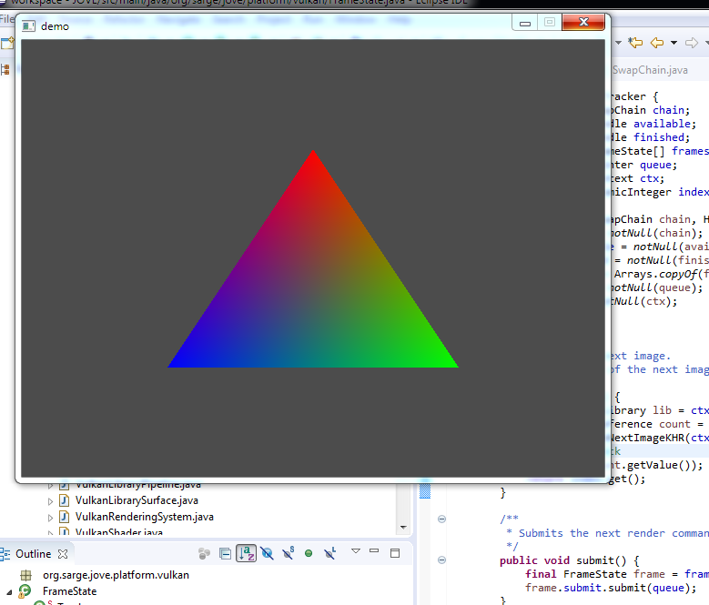

## Overview

We are on the last lap for the goal of this phase of development - rendering a simple triangle.

The final components we need to complete the demo are the command sequence for drawing the triangle and a simple render loop that acquires and presents a frame.

---

## Commands

### Introduction

Vulkan implements work to performed on a queue by recording a sequence of _commands_ to a _command buffer_, which is allocated and managed by a _command pool_.

For the triangle demo the command sequence is:
1. start the render pass
2. bind the pipeline
3. draw the triangle
3. end the render pass

To specify this chain of commands we would again like to design a fluid API as illustrated by the following pseudo-code:

```java
Command draw = ...

buffer
    .begin()
    .add(pass.begin())
    .add(pipeline.bind())
    .add(draw)
    .add(pass.end());
    .end();
```

### Command Interface

We start with an outline class for commands, buffers and pools:

```java
/**
 * A <i>command</i> encapsulates a piece of work performed on a {@link Command.Buffer}.
 */
@FunctionalInterface
public interface Command {
    /**
     * Executes this command.
     * @param lib       Vulkan library
     * @param buffer    Command buffer handle
     */
    void execute(VulkanLibrary lib, Handle buffer);

    /**
     * A <i>command buffer</i> is allocated by a {@link Pool} and used to record commands.
     */
    class Buffer implements NativeObject {
    }

    /**
     * A <i>command pool</i> allocates and maintains command buffers that are used to perform work on a given {@link Queue}.
     */
    class Pool extends AbstractVulkanObject {
    }
}
```

The command interface abstracts the signature of a `VkCmdXXX` command whose arguments are always comprised of the API and a handle to the command buffer.

### Command Pool

We start with the command pool which is created using a static factory:

```java
class Pool extends AbstractVulkanObject {
    /**
     * Creates a command pool for the given queue.
     * @param queue     Work queue
     * @param flags     Flags
     */
    public static Pool create(Queue queue, VkCommandPoolCreateFlag... flags) {
        // Init pool descriptor
        final VkCommandPoolCreateInfo info = new VkCommandPoolCreateInfo();
        info.queueFamilyIndex = queue.family().index();
        info.flags = IntegerEnumeration.mask(flags);

        // Create pool
        final LogicalDevice dev = queue.device();
        final VulkanLibrary lib = dev.library();
        final PointerByReference pool = lib.factory().pointer();
        check(lib.vkCreateCommandPool(dev.handle(), info, null, pool));

        // Create pool
        return new Pool(pool.getValue(), queue);
    }

    private final Queue queue;

    /**
     * Constructor.
     * @param handle        Command pool handle
     * @param queue         Work queue
     */
    private Pool(Pointer handle, Queue queue) {
        super(handle, queue.device(), queue.device().library()::vkDestroyCommandPool);
        this.queue = notNull(queue);
    }
}
```

To allocate one-or-more command buffers we add the following factory:

```java
/**
 * Allocates a number of command buffers from this pool.
 * @param num           Number of buffers to allocate
 * @param primary       Whether primary or secondary
 * @return Allocated buffers
 */
public List<Buffer> allocate(int num, boolean primary) {
    // Init descriptor
    final var info = new VkCommandBufferAllocateInfo();
    info.level = primary ? VkCommandBufferLevel.VK_COMMAND_BUFFER_LEVEL_PRIMARY : VkCommandBufferLevel.VK_COMMAND_BUFFER_LEVEL_SECONDARY;
    info.commandBufferCount = num;
    info.commandPool = this.handle();

    // Allocate buffers
    final LogicalDevice dev = queue.device();
    final VulkanLibrary lib = dev.library();
    final Pointer[] handles = lib.factory().pointers(num);
    check(lib.vkAllocateCommandBuffers(dev.handle(), info, handles));

    // Create buffers
    final var list = Arrays
            .stream(handles)
            .map(ptr -> new Buffer(ptr, this))
            .collect(toList());

    // Register buffers
    buffers.addAll(list);

    return list;
}
```

Note that the pool tracks the buffers that have been allocated:

```java
class Pool {
    private final Collection<Buffer> buffers = ConcurrentHashMap.newKeySet();

    ...

    @Override
    public synchronized void destroy() {
        buffers.clear();
        super.destroy();
    }
}
```

We also add the following methods to release some or all of the allocated buffers:

```java
/**
 * Frees <b>all</b> command buffers in this pool.
 */
public synchronized void free() {
    free(buffers);
    buffers.clear();
}

/**
 * Releases a set of command buffers back to this pool.
 * @param buffers Buffers to release
 */
private void free(Collection<Buffer> buffers) {
    final LogicalDevice dev = super.device();
    dev.library().vkFreeCommandBuffers(dev.handle(), this.handle(), buffers.size(), Handle.toArray(buffers));
}
```

### Command Buffer

A command buffer is used to **record** a sequence of commands, i.e. the commands are not executed immediately but are submitted to a work queue for execution by the hardware.

We define a command buffer as follows:

```java
class Buffer implements NativeObject {
    /**
     * Buffer state.
     */
    private enum State {
        UNDEFINED,
        RECORDING,
        READY,
    }

    private final Handle handle;
    private final Pool pool;

    private State state = State.UNDEFINED;

    /**
     * Constructor.
     * @param handle        Command buffer handle
     * @param pool          Parent pool
     */
    private Buffer(Pointer handle, Pool pool) {
        this.handle = new Handle(handle);
        this.pool = notNull(pool);
    }
}
```

The _state_ is used to track whether the buffer has been recorded.

The `begin()` method is used to start recording:

```java
/**
 * Starts command buffer recording.
 * @param flags Flags
 * @throws IllegalStateException if this buffer is not ready for recording
 */
public Buffer begin(VkCommandBufferUsageFlag... flags) {
    // Check buffer can be recorded
    if(state != State.UNDEFINED) throw new IllegalStateException(...);

    // Start buffer
    final VkCommandBufferBeginInfo info = new VkCommandBufferBeginInfo();
    info.flags = IntegerEnumeration.mask(flags);
    info.pInheritanceInfo = null;
    check(lib.vkBeginCommandBuffer(handle, info));

    // Start recording
    state = State.RECORDING;
    return this;
}
```

Specific commands can then be added to the sequence:

```java
/**
 * Adds a command.
 * @param cmd Command
 * @throws IllegalStateException if this buffer is not recording
 */
public Buffer add(Command cmd) {
    if(state != State.RECORDING) throw new IllegalStateException(...);
    cmd.execute(lib, handle);
    return this;
}
```

Finally the `end()` method finishes recording:

```java
/**
 * Ends recording.
 * @throws IllegalStateException if this buffer is not recording
 * @throws IllegalArgumentException if no commands have been recorded
 */
public Buffer end() {
    if(state != State.RECORDING) throw new IllegalStateException(...);
    check(lib.vkEndCommandBuffer(handle));
    state = State.READY;
    return this;
}
```

Notes:
- We could have introduced a further recorder class but it hardly seems worthwhile.
- Command buffers are managed by the pool and are not explicitly destroyed.

---

## Command Implementation

We can now implement the specific commands required for the triangle demo (see the pseudo-code above):

### Rendering

We add the following factory method to the render pass class to start rendering:

```java
/**
 * Creates a command to begin rendering.
 * @param buffer Frame buffer
 * @return Begin rendering command
 */
public Command begin(FrameBuffer buffer) {
    // Create descriptor
    final VkRenderPassBeginInfo info = new VkRenderPassBeginInfo();
    info.renderPass = this.handle();
    info.framebuffer = buffer.handle();
    info.renderArea = buffer.extents().toRect2D();

    // Init clear values
    // TODO - hard-coded!
    final Colour col = new Colour(0.3f, 0.3f, 0.3f, 1);
    final VkClearValue clear = new VkClearValue();
    clear.setType("color");
    clear.color.setType("float32");
    clear.color.float32 = col.toArray();
    info.clearValueCount = 1;
    info.pClearValues = clear;
    // ...TODO

    // Create command
    return (lib, handle) -> lib.vkCmdBeginRenderPass(handle, info, VkSubpassContents.VK_SUBPASS_CONTENTS_INLINE);
}
```

This command also initialises the clear values for the frame buffer attachments - we have hard-coded a grey colour for the single colour attachment.  In a future chapter we will replace this temporary code with a proper implementation for both colour and depth attachments.

> We explain the purpose of the various `setType()` calls when we address depth buffers in the [models](/JOVE/blog/part-4-models/model-loader) chapter.

We introduce a simple RGBA colour domain object for the clear colour:

```java
public record Colour(float red, float green, float blue, float alpha) {
    /**
     * White colour.
     */
    public static final Colour WHITE = new Colour(1, 1, 1, 1);

    /**
     * Black colour.
     */
    public static final Colour BLACK = new Colour(0, 0, 0, 1);

    public Colour {
        Check.isPercentile(red);
        Check.isPercentile(green);
        Check.isPercentile(blue);
        Check.isPercentile(alpha);
    }

    /**
     * @return This colour as an RGBA array of floating-point values
     */
    public float[] toArray() {
        return new float[]{red, green, blue, alpha};
    }

    @Override
    public String toString() {
        return Arrays.toString(toArray());
    }
}
```

Finally we add the following command to end a render pass:

```java
/**
 * End render pass command.
 */
public static final Command END_COMMAND = (api, buffer) -> api.vkCmdEndRenderPass(buffer);
```

### Bind Pipeline

To bind the pipeline in the render sequence we add the following factory to the pipeline class:

```java
/**
 * Creates a command to bind this pipeline.
 * @return New bind pipeline command
 */
public Command bind() {
    return (lib, buffer) -> lib.vkCmdBindPipeline(buffer, VkPipelineBindPoint.VK_PIPELINE_BIND_POINT_GRAPHICS, this.handle());
}
```

### Drawing

For the moment we hard-code the drawing command in the demo:

```java
Command draw = (api, handle) -> api.vkCmdDraw(handle, 3, 1, 0, 0);
```

This command specified three vertices in a single instance, both starting at index zero.

Later we will factor this out to a factory when we address vertex buffers and models.

### Submitting Work

Submitting a command buffer to a work queue involves populating a descriptor of the work to be performed comprising the command buffers to execute and various synchronisation declarations.
We will ignore synchronisation until a future chapter as it is not needed for the triangle demo.

We define a _work_ class with the obligatory builder:

```java
@FunctionalInterface
public interface Work {
    /**
     * Submits this work to the given queue.
     */
    void submit();

    public static class Builder {
        private final Queue queue;
        private final List<Command.Buffer> buffers = new ArrayList<>();
    }
}
```

A command buffer is added to the work submission using the following method:

```java
public Builder add(Command.Buffer buffer) {
    // Validate queue
    if(queue.family() != buffer.pool().queue().family()) {
        throw new IllegalArgumentException(...);
    }

    // Add buffer to this work
    buffers.add(buffer);

    return this;
}
```

Note that each submission must be allocated from the same queue family.

Finally we populate the submission descriptor and invoke the relevant API method:

```java
public Work build() {
    // Create submission descriptor
    if(buffers.isEmpty()) throw new IllegalArgumentException("No command buffers specified");

    // Populate command buffers
    final VkSubmitInfo info = new VkSubmitInfo();
    info.commandBufferCount = buffers.size();
    info.pCommandBuffers = Handle.toPointerArray(buffers);

    // TODO - synchronisation
    // TODO - stage flags

    // Create work
    return () -> {
        final VulkanLibrary lib = queue.device().library();
        check(lib.vkQueueSubmit(queue.handle(), 1, new VkSubmitInfo[]{info}, null));
    };
}
```

---

## Integration

### Rendering Sequence

We can now integrate all of the above to create and record the rendering sequence.

First we create a command buffer for each swapchain image:

```java
final Command.Pool pool = Command.Pool.create(presentationQueue);
final List<Command.Buffer> commands = pool.allocate(buffers.size());
```

Next we record the rendering sequence for each frame-buffer:

```java
for(int n = 0; n < buffers.size(); ++n) {
    final Command.Buffer cmd = commands.get(n);
    final FrameBuffer fb = buffers.get(n);
    cmd.begin()
        .add(pass.begin(fb))
        .add(pipeline.bind())
        .add(draw)
        .add(RenderPass.END_COMMAND)
    .end();
}
```

We have several parallel lists here sized by the swapchain buffering strategy (the swapchain image/views, the frame buffers and the commands) which we will eventually want to compose into an actual object but the above is fine for the moment.

### Render Loop

Our first render 'loop' will be a bit of a bodge - to render the triangle we emulate a single frame:

```java
final int index = chain.acquire();

new Work.Builder()
    .add(commands.get(index))
    .stage(VkPipelineStageFlag.VK_PIPELINE_STAGE_TOP_OF_PIPE_BIT)
    .build()
    .submit();

present.waitIdle();

chain.present(present);

Thread.sleep(1000);
```

We could have implemented a proper acquire-render-present loop utilising the swap-chain images but the above is sufficient to test the demo - we will be re-implementing this properly in future chapters (and adding input handling so we can terminate the thread).

### All that for a triangle?

If all goes well when we run the demo we should see the following:





Viola!

There are a few gotchas that could result in staring at a blank screen:

- Ensure that a diagnostics handler has been attached to the Vulkan instance to check for obvious mistakes.

- Although not covered in this demo the rasterizer pipeline stage specifies culling of back-facing polygons by default.  The triangle vertices are counter-clockwise (which _should_ be the default winding order) but changing the culling mode (or disabling culling altogether) is worth checking.

- Double-check that the format of the swapchain images is as expected.

- Walk through the configuration of the render pass and ensure that the correct load/store operations and image layouts are specified.

- Check the arguments for the hard-coded drawing command (they are all integers and could easily be accidentally transposed).

---

## Summary

In this final chapter for this phase of development we implemented commands and a crude render loop to display a triangle.

