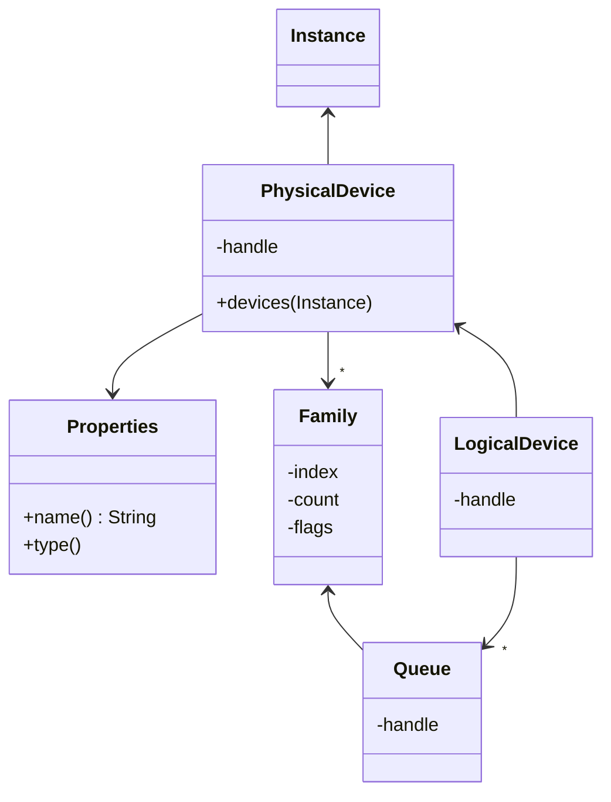

---

## Contents

- [Overview](#overview)
- [Physical Devices](#physical-devices)
- [Device Selection](#device-selection)
- [Logical Device](#logical-device)
- [Improvements](#improvements)

---

## Overview

Hardware components that support Vulkan are represented by a _physical device_ which defines the capabilities of that component (rendering, data transfer, etc).  In general there will be a single physical device (i.e. the GPU) or perhaps also an on-board graphics device for a laptop.

A _logical device_ is an instance of a physical device and is the central component for all subsequent Vulkan functionality.  The logical device also exposes a number of asynchronous _work queues_ that are used for various tasks such as invoking rendering, transferring data to/from the hardware, etc.  The process of displaying a rendered frame is known as _presentation_ and is implemented by Vulkan as a task on the _presentation queue_.

Creating the logical device consists of the following steps:

1. Enumerate the physical devices available on the hardware.

2. Select one that satisfies the requirements of the application.

3. Create a logical device for the selected physical device.

4. Retrieve the required work queues.

For our demo we need to choose a device that supports presentation so the _desktop_ library will be extended to create a window and a Vulkan rendering surface.  We _could_ use Vulkan extensions to implement the surface from the ground up but it makes sense to take advantage of the platform-independant implementation.  The disadvantage of this approach is that the logic becomes a little convoluted as the surface and Vulkan components are slightly inter-dependant, but this seems an acceptable trade-off.

---

## Physical Devices

### Device and Queues

We first implement new domain objects for the physical device and the supported work queues:

```java
public class PhysicalDevice {
    private final Pointer handle;
    private final Instance instance;
    private final List<Family> families;
}
```

The physical device specifies a number of _queue families_ that define the capabilities of work that can be performed by that device:

```java
public record Queue(Pointer handle, Family family) {
    /**
     * A <i>queue family</i> defines the properties of a group of queues.
     */
    public record Family(int index, int count, Set<VkQueueFlag> flags) {
        public Family {
            Check.zeroOrMore(index);
            Check.oneOrMore(count);
            flags = Set.copyOf(flags);
        }
    }
}
```

Note that the constructor for the family copies the set of queue flags and rewrites the constructor argument.  This is the standard approach for ensuring that a record class is immutable, although unfortunately this is currently flagged as a warning in our IDE.

### Enumerating the Physical Devices

To enumerate the available physical devices we invoke the `vkEnumeratePhysicalDevices` API method _twice_:

1. Once to retrieve the number of available devices via an integer-by-reference value (the array parameter is set to `null`).

2. Again to retrieve the actual array of device handles.

This process is wrapped in the following factory method:

```java
public static Stream<PhysicalDevice> devices(Instance instance) {
    // Determine array length
    IntByReference count = instance.factory().integer();
    check(api.vkEnumeratePhysicalDevices(instance.handle(), count, null));

    // Allocate array
    Pointer[] array = new Pointer[count.getValue()];

    // Retrieve array
    if(array.length > 0) {
        check(api.vkEnumeratePhysicalDevices(instance.handle(), count, array));
    }

    // Create devices
    return Arrays.stream(array).map(ptr -> create(ptr, instance));
}
```

The `create` method is a helper that retrieves the array of queue families for each device:

```java
private static PhysicalDevice create(Pointer handle, Instance instance) {
    // Count number of families
    VulkanLibrary lib = instance.library();
    IntByReference count = instance.factory().integer();
    lib.vkGetPhysicalDeviceQueueFamilyProperties(handle, count, null);

    // Retrieve families
    VkQueueFamilyProperties[] array;
    if(count.getValue() > 0) {
        array = (VkQueueFamilyProperties[]) new VkQueueFamilyProperties().toArray(count.getValue());
        lib.vkGetPhysicalDeviceQueueFamilyProperties(handle, count, array[0]);
    }
    else {
        array = Array.newInstance(VkQueueFamilyProperties.class, 0);
    }
    
    ...
}
```

Note that again the same API method is invoked twice to retrieve the queue families.  However in this case we use the JNA `toArray` factory method on an instance of a `VkQueueFamilyProperties` structure to allocate the array and pass the _first_ element to the API method (i.e. the array maps to a native pointer-to-structure).  This common pattern will be abstracted at the end of the chapter.

Finally another helper is implemented to create a queue family domain object:

```java
private static Family family(int index, VkQueueFamilyProperties props) {
    Set<VkQueueFlag> flags = IntegerEnumeration.mapping(VkQueueFlag.class).enumerate(props.queueFlags);
    return new Family(index, props.queueCount, flags);
}
```

Which is used to transform the array of structures when creating the device:

```java
// Create queue families
List<Family> families = IntStream
    .range(0, props.length)
    .mapToObj(n -> family(n, props[n]))
    .collect(toList());

// Create device
return new PhysicalDevice(handle, instance, families);
```

### Device Properties

The physical device exposes a set of properties containing the name and type of the device, hardware limits, etc:

```java
public VkPhysicalDeviceProperties properties() {
    var props = new VkPhysicalDeviceProperties();
    VulkanLibrary lib = instance.library();
    lib.vkGetPhysicalDeviceProperties(PhysicalDevice.this, props);
    return props;
}
```

A new JNA library is added for the API methods used thus far:

```java
interface VulkanLibraryPhysicalDevice {
    int  vkEnumeratePhysicalDevices(Pointer instance, IntByReference count, Pointer[] devices);
    void vkGetPhysicalDeviceProperties(Pointer device, VkPhysicalDeviceProperties props);
    void vkGetPhysicalDeviceQueueFamilyProperties(Pointer device, IntByReference count, VkQueueFamilyProperties props);
}
```

The following temporary code can now be added to the demo to dump the available devices:

```java
PhysicalDevice
    .devices(instance)
    .map(PhysicalDevice::properties)
    .map(props -> props.deviceName)
    .map(String::new)
    .forEach(System.out::println);
```

---

## Device Selection

### Application Window

To select the physical device that supports presentation we first need a Vulkan surface which is derived from a native window created using GLFW:

```java
public class Window {
    private final Desktop desktop;
    private final Pointer handle;
    private final Descriptor descriptor;

    public void destroy() {
        lib.glfwDestroyWindow(handle);
    }
}
```

The _window descriptor_ wraps up the details of the window in a simple record:

```java
public record Descriptor(String title, Dimensions size, Set<Property> properties) {
}
```

The _properties_ is an enumeration of the various visual capabilities of a window:

```java
public enum Property {
    RESIZABLE(0x00020003),
    DECORATED(0x00020005),
    AUTO_ICONIFY(0x00020006),
    MAXIMISED(0x00020008),
    DISABLE_OPENGL(0x00022001),

    private final int hint;

    private Property(int hint) {
        this.hint = hint;
    }

    void apply(DesktopLibrary lib) {
        int value = this == DISABLE_OPENGL ? 0 : 1;
        lib.glfwWindowHint(hint, value);
    }
}
```

The enumeration values (window _hints_ in GLFW parlance) are copied from the header file.

A hint is applied to a new window by the following helper:

```java
void apply(DesktopLibrary lib) {
    int value = this == DISABLE_OPENGL ? 0 : 1;
    lib.glfwWindowHint(hint, value);
}
```

The window is created via a factory method given a descriptor, starting with the specified hints:

```java
public static Window create(Desktop desktop, Descriptor descriptor) {
    DesktopLibrary lib = desktop.library();
    lib.glfwDefaultWindowHints();
    for(Property p : descriptor.properties) {
        p.apply(lib);
    }
    ...
}
```

Next the GLFW method is invoked to create the window:

```java
Dimensions size = descriptor.size();
Pointer window = lib.glfwCreateWindow(size.width(), size.height(), descriptor.title(), null, null);
if(window == null) throw new RuntimeException(...);
```

And finally the domain object is instantiated:

```java
return new Window(desktop, window, descriptor);
```

Notes:

* This is a bare-bones implementation sufficient for the triangle demo, however we will almost certainly need to refactor this code to support richer functionality, e.g. full-screen windows.

* A convenience builder is also added for the window descriptor.

* By default GLFW creates an OpenGL surface for a new window which is disabled using the `DISABLE_OPENGL` window hint.

* The argument for this hint is irritatingly the opposite of what one would expect (and all the other hints).

* The above implementation ignores display monitors for the moment.

To create the Vulkan surface the following factory is added to the new class:

```java
public Pointer surface(Pointer instance) {
    DesktopLibrary lib = desktop.library();
    PointerByReference ref = new PointerByReference();
    int result = lib.glfwCreateWindowSurface(instance, this.handle(), null, ref);
    if(result != 0) {
        throw new RuntimeException(...);
    }
    return ref.getValue();
}
```

In the demo we can now create a native window and retrieve the handle to the Vulkan surface:

```java
// Create window
Window window = new Window.Builder()
    .title("demo")
    .size(new Dimensions(1280, 760))
    .property(Window.Property.DISABLE_OPENGL)
    .build(desktop);

// Retrieve rendering surface
Pointer surface = window.surface(instance.handle());
```

### Selector

As previously mentioned the process of selecting the physical device is slightly messy due to the inter-dependencies between the Vulkan instance, the rendering surface and the presentation queue.  This is exacerbated by the mechanism Vulkan uses to select the work queues which essentially requires the same logic to be applied twice: once to select the physical device with the required queue capabilities, and again to retrieve each queue from the resultant logical device.

After trying several approaches we settled on the design described below which determines the queue family as a _side effect_ of selecting the device (the same approach is used in the tutorial). This is something we would generally try to avoid but it seems acceptable in this case, and the resultant API is at least relatively simple from the perspective of the user.

The _selector_ composes a predicate for a device and queue family and exposes methods for both cases:

```java
public static class Selector implements Predicate<PhysicalDevice> {
    private final BiPredicate<PhysicalDevice, Family> predicate;

    @Override
    public boolean test(PhysicalDevice dev) {
        return find(dev).isPresent();
    }

    public Family select(PhysicalDevice dev) {
        return find(dev).orElseThrow();
    }

    private Optional<Family> find(PhysicalDevice dev) {
        ...
    }
}
```

The local `find` method applies the predicate and caches the results:

```java
private final Map<PhysicalDevice, Optional<Family>> results = new HashMap<>();

...

private Optional<Family> find(PhysicalDevice dev) {
    return results.computeIfAbsent(dev, this::findLocal);
}

private Optional<Family> findLocal(PhysicalDevice dev) {
    return
        dev
        .families
        .stream()
        .filter(family -> predicate.test(dev, family))
        .findAny();
}
```

Finally we add a factory method to create a selector that matches a device by queue properties:

```java
public static Selector of(VkQueueFlag... flags) {
    var copy = Arrays.asList(flags);
    BiPredicate<PhysicalDevice, Family> predicate = (ignored, family) -> family.flags().containsAll(copy);
    return new Selector(predicate);
}
```

And a second implementation that selects devices that support presentation to the given Vulkan surface:

```java
public static Selector of(Handle surface) {
    BiPredicate<PhysicalDevice, Family> predicate = (dev, family) -> dev.isPresentationSupported(surface, family);
    return new Selector(predicate);
}
```

Which delegates to a new query method on the device:

```java
public boolean isPresentationSupported(Handle surface, Family family) {
    VulkanLibrary lib = instance.library();
    IntByReference supported = instance.factory().integer();
    check(lib.vkGetPhysicalDeviceSurfaceSupportKHR(this, family.index(), surface, supported));
    return supported.getValue() == 1;
}
```

Two selectors are created in the demo to find a matching physical device:

```java
// Select a device that supports rendering
Selector graphics = Selector.of(VkQueueFlag.GRAPHICS);

// Select a device that supports presentation
Selector presentation = Selector.of(surface);

// Find matching device
PhysicalDevice gpu = PhysicalDevice
    .devices(instance)
    .filter(graphics)
    .filter(presentation)
    .findAny()
    .orElseThrow(() -> new RuntimeException(...));
```

Finally the queue families can then be queried from the selectors:

```java
Family graphicsFamily = graphics.select(gpu);
Family presentationFamily = presentation.select(gpu);
```

Note that the resultant families could actually refer to the same object depending on the hardware implementation.

---

## Logical Device

### Domain Object

The first cut domain object for the logical device is as follows:

```java
public class LogicalDevice {
    private final Pointer handle;
    private final PhysicalDevice parent;
    private final VulkanLibrary lib;
    private final Map<Family, List<Queue>> queues;

    public void destroy() {
        lib.vkDestroyDevice(handle, null);
    }
}
```

We also provide a convenience accessor to retrieve a single work queue for a given family:

```java
public Queue queue(Family family) {
    List<Queue> list = queues.get(family);
    if((list == null) || list.isEmpty()) throw new IllegalArgumentException(...);
    return list.get(0);
}
```

And a helper method to block execution until the device is idle:

```java
public void waitIdle() {
    check(lib.vkDeviceWaitIdle(handle));
}
```

Similarly for an individual queue:

```java
public record Queue {
    public void waitIdle(VulkanLibrary lib) {
        check(lib.vkQueueWaitIdle(handle));
    }
}
```

### Builder

The logical device is another object that is highly configurable and is therefore constructed via a builder:

```java
public static class Builder {
    private final PhysicalDevice parent;
    private final Set<String> extensions = new HashSet<>();
    private final Set<String> layers = new HashSet<>();
    private final Map<Family, List<Percentile>> queues = new HashMap<>();
}
```

The builder provides a number of over-loaded methods to specify _required_ work queues for the device (delegating to the final base implementation):

```java
public Builder queue(Family family) {
    return queues(family, 1);
}

public Builder queues(Family family, int num) {
    return queues(family, Collections.nCopies(num, Percentile.ONE));
}

public Builder queues(Family family, List<Percentile> priorities) {
    queues.put(family, new RequiredQueue(family, priorities));
    return this;
}
```

Notes:

- The _family_ is a queue family selected from the parent physical device.

- The _priorities_ is a list of percentile values that specifies the priority of each required queue.

- The `Percentile` class is a custom type for a percentile represented as a 0..1 floating-point value.

- We can specify extensions and validation layers at both the instance and device level, however more recent Vulkan implementations will ignore layers specified at the device level (we retain both for backwards compatibility).

The `RequiredQueue` is a transient record class:

```java
private record RequiredQueue(Family family, List<Percentile> priorities) {
    private void populate(VkDeviceQueueCreateInfo info) {
        ...
    }
}
```

The `build` method populates a Vulkan descriptor for the logical device:

```java
public LogicalDevice build() {
    // Create descriptor
    var info = new VkDeviceCreateInfo();

    // Add required extensions
    info.ppEnabledExtensionNames = new StringArray(extensions.toArray(String[]::new));
    info.enabledExtensionCount = extensions.size();

    // Add validation layers
    info.ppEnabledLayerNames = new StringArray(layers.toArray(String[]::new));
    info.enabledLayerCount = layers.size();

    // Add queue descriptors
    info.queueCreateInfoCount = queues.size();
    info.pQueueCreateInfos = StructureHelper.pointer(queues.entrySet(), VkDeviceQueueCreateInfo::new, Builder::populate);
    ...
}
```

JNA requires a native array to be a contiguous memory block (as opposed to a Java array where the memory address of the elements is arbitrary).
Here we introduce the `StructureHelper` helper class (detailed at the end of the chapter) which handles the transformation of a Java collection to a JNA structure array.

The `populate` method is invoked by the helper to 'fill' the JNA structure from a domain object (the required queue in this case):

```java
private void populate(VkDeviceQueueCreateInfo info) {
    // Allocate contiguous memory block for the priorities
    Percentile[] array = priorities.toArray(Percentile[]::new);
    Memory mem = new Memory(array.length * Float.BYTES);
    for(int n = 0; n < array.length; ++n) {
        mem.setFloat(n * Float.BYTES, array[n].floatValue());
    }

    // Populate queue descriptor
    info.queueCount = array.length;
    info.queueFamilyIndex = family.index();
    info.pQueuePriorities = mem;
}
```

Note that again we create a contiguous memory block for the array of queue priorities mapping to a `const float*` native type.

The builder next invokes the API to create the device:

```java
Instance instance = parent.instance();
VulkanLibrary lib = instance.library();
ReferenceFactory factory = instance.factory();
PointerByReference handle = factory.pointer();
check(lib.vkCreateDevice(parent, info, null, handle));
```

### Work Queues

Next the work queues are retrieved from the logical device:

```java
Map<Family, List<Queue>> map = queues
    .values()
    .stream()
    .map(required -> queues(handle.getValue(), required))
    .map(Arrays::asList)
    .flatMap(List::stream)
    .collect(groupingBy(Queue::family));
```

Which uses the following helper to instantiate an array of queues for each entry:

```java
private Queue[] queues(Pointer dev, RequiredQueue required) {
    // Init library
    Instance instance = parent.instance();
    Library lib = instance.library();
    PointerByReference ref = instance.factory().pointer();

    // Retrieve queues
    int count = required.priorities.size();
    Queue[] queues = new Queue[count];
    for(int n = 0; n < count; ++n) {
        lib.vkGetDeviceQueue(dev, required.family.index(), n, ref);
        queues[n] = new Queue(ref.getValue(), required.family);
    }

    return queues;
}
```

Finally the builder creates the domain object for the new device:

```java
return new LogicalDevice(handle.getValue(), parent, map);
```

The new API is implemented as an inner member of the logical device class:

```java
interface Library {
    int  vkCreateDevice(Pointer physicalDevice, VkDeviceCreateInfo pCreateInfo, Pointer pAllocator, PointerByReference device);
    void vkDestroyDevice(Pointer device, Pointer pAllocator);
    void vkGetDeviceQueue(Pointer device, int queueFamilyIndex, int queueIndex, PointerByReference pQueue);
    int  vkDeviceWaitIdle(Pointer device);
    int  vkQueueWaitIdle(Pointer queue);
}
```

The various API interfaces are then integrated into the main Vulkan library:

```java
public interface VulkanLibrary extends Library, DeviceLibrary, ...
```

Where convenient we also implement intermediate aggregations, e.g. for the various device libraries:

```java
interface DeviceLibrary extends Instance.Library, PhysicalDevice.Library, LogicalDevice.Library
```

From now on we take this approach of aggregated API libraries implemented as inner classes of the companion domain objects.  This co-locates each API with its associated class and reduces the number of super-interfaces for the root Vulkan library.

In the demo we can now create the logical device and retrieve the work queues:

```java
// Create device
LogicalDevice dev = new LogicalDevice.Builder(gpu)
    .extension(VulkanLibrary.EXTENSION_SWAP_CHAIN)
    .layer(ValidationLayer.STANDARD_VALIDATION)
    .queue(graphicsFamily)
    .queue(presentationFamily)
    .build();
    
// Lookup work queues
Queue graphicsQueue = dev.queue(graphicsFamily);
Queue presentationQueue = dev.queue(presentationFamily);
```

---

## Improvements

### Two-Stage Invocation

When enumerating the physical devices we first came across API methods that are invoked __twice__ to retrieve data from Vulkan (usually an array of structures or pointer handles).

The process is generally:

1. Invoke an API method with an integer-by-reference _count_ to determine the size of the results (the data argument is `null`).

2. Allocate the data or array accordingly.

3. Invoke again passing both the count and the allocated object to populate the returned results.

This is a common pattern across the Vulkan API which we refer to as _two-stage invocation_.

The following interface abstracts an API method that employs two-stage invocation:

```java
@FunctionalInterface
public interface VulkanFunction<T> {
    /**
     * Vulkan API method that retrieves data using the <i>two-stage invocation</i> approach.
     * @param count         Size of the data
     * @param data          Returned data or {@code null} to retrieve the size of the data
     * @return Vulkan result code
     */
    int enumerate(IntByReference count, T data);
}
```

The API method to enumerate the physical devices can now be defined thus:

```java
VulkanFunction<Pointer[]> func = (count, devices) -> lib.vkEnumeratePhysicalDevices(instance, count, devices);
```

Two-stage invocation of the function is encapsulated in the following helper:

```java
static <T> T invoke(VulkanFunction<T> func, IntByReference count, IntFunction<T> factory) {
    // Invoke to determine the size of the data
    check(func.enumerate(count, null));

    // Instantiate the data object
    int size = count.getValue();
    T data = factory.apply(size);

    // Invoke again to populate the data object
    if(size > 0) {
        check(func.enumerate(count, data));
    }

    return data;
}
```

The process of enumerating the physical devices can now be refactored to the following more concise code:

```java
public static Stream<PhysicalDevice> devices(Instance instance) {
    VulkanFunction<Pointer[]> func = (count, devices) -> instance.library().vkEnumeratePhysicalDevices(instance, count, devices);
    IntByReference count = instance.factory().integer();
    Pointer[] handles = VulkanFunction.invoke(func, count, Pointer[]::new);
    return Arrays.stream(handles).map(ptr -> create(ptr, instance));
}
```

For an array of JNA structures we need a second, slightly different implementation since the array __must__ be a contiguous block of memory allocated using the `toArray` helper:

```java
static <T extends Structure> T[] invoke(VulkanFunction<T> func, IntByReference count, Supplier<T> identity) {
    // Invoke to determine the length of the array
    check(func.enumerate(count, null));

    // Instantiate the structure array
    T[] array = (T[]) identity.get().toArray(count.getValue());

    // Invoke again to populate the array (note passes first element)
    if(array.length > 0) {
        check(func.enumerate(count, array[0]));
    }

    return array;
}
```

Notes:

* The _identity_ generates an instance of the structure used to allocate the resultant array.

* In this case the API method accepts a pointer to a structure array which maps to the __first__ element of the allocated Java array.

As an example, the code to retrieve the queue families for a physical device now becomes:

```java
VulkanFunction<VkQueueFamilyProperties> func = (count, array) -> instance.library().vkGetPhysicalDeviceQueueFamilyProperties(handle, count, array);
IntByReference count = instance.factory().integer();
VkQueueFamilyProperties[] props = VulkanFunction.invoke(func, count, VkQueueFamilyProperties::new);
```

### Structure Collector

Vulkan makes heavy use of structures to configure a variety of objects.

However an array of JNA structures poses a number of problems:

* Unlike a standard POJO an array of JNA structures __must__ be allocated using the JNA `toArray` helper method to create a contiguous memory block.

* Obviously we must therefore know the size of the array _before_ it can be populated, which imposes constraints on how the data is handled, in particular whether we can employ Java streams.

* Many API methods expect a pointer-to-array, i.e. the __first__ element of the array.

* Additionally there are edge cases where `null` is a valid argument.

None of these are particularly difficult to overcome but the number of situations where this occurs makes the code tedious to develop, error-prone, and less testable.

To address these issues we implement the following helper that allocates and populates a JNA array from an arbitrary collection of domain objects:

```java
public final class StructureHelper {
    public static <T, R extends Structure> R[] array(Collection<T> data, Supplier<R> identity, BiConsumer<T, R> populate) {
        // Check for empty data
        if(data.isEmpty()) {
            return null;
        }

        // Allocate contiguous array
        @SuppressWarnings("unchecked")
        R[] array = (R[]) identity.get().toArray(data.size());

        // Populate array
        Iterator<T> itr = data.iterator();
        for(final R element : array) {
            populate.accept(itr.next(), element);
        }
        assert !itr.hasNext();

        return array;
    }
}
```

Notes:

- _T_ is the domain type, e.g. a map entry for a required queue in the logical device.

- _R_ is the array component type, e.g. `VkDeviceQueueCreateInfo`.

- _identity_ generates an instance of the structure used to allocate the array.

- And _populate_ 'fills' a JNA structure from the corresponding domain object (note that JNA structures do not support copying or cloning).

- This implementation uses an iterator since there is no simple means of instantiating a generic array (without passing additional arguments or peeking at the data collection).

For the case where the API method requires a pointer-to-array argument we provide the following alternative:

```java
public static <T, R extends Structure> R pointer(Collection<T> data, Supplier<R> identity, BiConsumer<T, R> populate) {
    // Construct array
    R[] array = array(data, identity, populate);

    // Handle empty case
    if(array == null) {
        return null;
    }

    // Convert to pointer-to-array
    R ptr = array[0];

    // Check valid structure
    if(!(ptr instanceof ByReference)) {
        throw new IllegalArgumentException("Pointer-to-array must be a by-reference structure: " + ptr.getClass());
    }

    return ptr;
}
```

Note that a pointer-to-array mandates that the structure is a JNA by-reference type.

In the logical device we use this helper to build the array of required queue descriptors:

```java
info.pQueueCreateInfos = StructureHelper.pointer(queues.entrySet(), VkDeviceQueueCreateInfo::new, Builder::populate);
```

Finally we also provide a generalised custom stream collector:

```java
/**
 * Helper - Creates a collector that constructs a contiguous array of JNA structures.
 * @param <T> Data type
 * @param <R> Resultant structure type
 * @param identity      Identity constructor
 * @param populate      Population function
 * @param chars         Collector characteristics
 * @return Structure collector
 * @see #array(Collection, Supplier, BiConsumer)
 */
public static <T, R extends Structure> Collector<T, ?, R[]> collector(Supplier<R> identity, BiConsumer<T, R> populate, Characteristics... chars) {
    BinaryOperator<List<T>> combiner = (left, right) -> {
        left.addAll(right);
        return left;
    };
    Function<List<T>, R[]> finisher = list -> array(list, identity, populate);
    return Collector.of(ArrayList::new, List::add, combiner, finisher, chars);
}
```

These helpers centralise the logic of allocating and populating a structure array using internal iteration.

---

## Summary

In this chapter we:

- Created a GLFW window and Vulkan surface

- Enumerated the physical devices available on the local hardware and selected one appropriate for the demo application.

- Created the logical device and work queues used in subsequent chapters

- Added supporting functionality for _two stage invocation_ and population of structure arrays.

The new device domain classes are illustrated in the following diagram:



