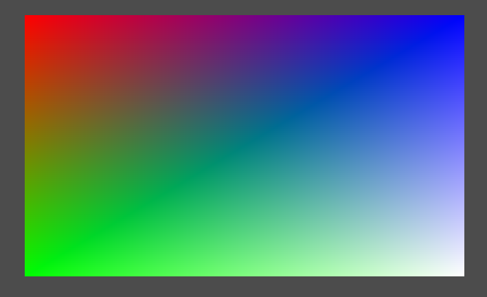
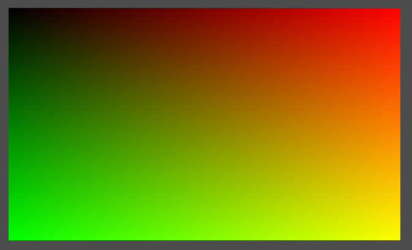

## Overview

In this chapter we will load and apply a _texture_ to the demo.

This involves uploading the image data to the hardware in a similar fashion to the vertex buffers in the previous chapter.  However for texture images we also make use of _pipeline barriers_ to transform the image to the appropriate layout during the loading process.

The process of loading a texture consists of the following steps:

1. Load the native image.

2. Transform the image to a format and structure supported by Vulkan.

3. Copy the image data to a staging buffer.

4. Create a texture on the hardware.

5. Transition the texture so it is ready for the image.

6. Copy the staged image data to the texture.

7. Transition the texture to a layout ready for sampling.

Note that unlike the swapchain images the application is responsible for allocating and managing texture images, therefore we will also refactor the existing image accordingly.

We will require the following components:

* A new domain object representing a platform-independant image and an associated loader.

* The refactored image class.

* A command to copy the image data to the texture.

* Pipeline barriers.

* The texture sampler.

* Texture coordinates.

We will first modify the demo to render a quad and implement texture coordinates before moving on to loading the image to the texture.

---

## Texture Coordinates

### Quad

First we will change the vertex data to render a coloured quad with white in the bottom-right corner:

```java
Vertex.of(new Point(-0.5f, -0.5f, 0), new Colour(1, 0, 0, 1)),
Vertex.of(new Point(-0.5f, +0.5f, 0), new Colour(0, 1, 0, 1)),
Vertex.of(new Point(+0.5f, -0.5f, 0), new Colour(0, 0, 1, 1)),
Vertex.of(new Point(+0.5f, +0.5f, 0), new Colour(1, 1, 1, 1)),
```

The default drawing primitive is a _triangle strip_ with vertices ordered as follows:

```
0---2---4-- etc
|   |   |
1---3---5
```

The first triangle is comprised of the first three vertices with each subsequent triangle incrementing the 'index' by one resulting in 012, 123, 234, etc. 

Notes:

* By default the Y direction is inverted in the Vulkan coordinate system.

* The triangles in a strip have an _alternating_ winding order.

After changing the number of vertices to 4 in the drawing command we should see something like the following:



### Coordinates

Next we implement the texture coordinate domain object:

```java
public interface Coordinate extends Vertex.Component {
    record Coordinate1D(float u) implements Coordinate {
        ...
    }

    record Coordinate2D(float u, float v) implements Coordinate {
        public static final Layout LAYOUT = Layout.of(2);

        @Override
        public final void buffer(ByteBuffer buffer) {
            buffer.putFloat(u).putFloat(v);
        }

        @Override
        public Layout layout() {
            return LAYOUT;
        }
    }

    record Coordinate3D(float u, float v, float w) implements Coordinate {
        ...
    }
}
```

For convenience we define the texture coordinates for a quad in the 2D implementation:

```java
public static final Coordinate2D
    TOP_LEFT        = new Coordinate2D(0, 0),
    BOTTOM_LEFT     = new Coordinate2D(0, 1),
    TOP_RIGHT       = new Coordinate2D(1, 0),
    BOTTOM_RIGHT    = new Coordinate2D(1, 1);
```

We can now replace the colour data in the quad with texture coordinates as shown here for the top-left vertex:

```java
Vertex.of(new Point(-0.5f, -0.5f, 0), Coordinate2D.TOP_LEFT)
```

Finally we modify the second attribute of the vertex input pipeline stage to configure the structure of the texture coordinates:

```java
.binding()
    .index(0)
    .stride(Point.LAYOUT.length() + Coordinate2D.LAYOUT.length())
    .build()
.attribute()
    .binding(0)
    .location(0)
    .format(VkFormat.R32G32B32_SFLOAT)
    .offset(0)
    .build()
.attribute()
    .binding(0)
    .location(1)
    .format(VkFormat.R32G32_SFLOAT)
    .offset(Point.LAYOUT.length())
    .build()
```

### Vertex Shader

We modify the vertex shader to replace the colour with a texture coordinate which is passed through to the fragment shader:

```glsl
#version 450
#extension GL_ARB_separate_shader_objects : enable

layout(location = 0) in vec3 inPosition;
layout(location = 1) in vec2 inTexCoord;

layout(location = 0) out vec2 outTexCoord;

void main() {
    gl_Position = vec4(inPosition, 1.0);
    outTexCoord = inTexCoord;
}
```

In the fragment shader we fake a red-green colour based on the texture coordinates:

```glsl
#version 450 core

layout(location = 0) in vec2 texCoord;

layout(location = 0) out vec4 outColor;

void main(void) {
    outColor = vec4(texCoord.x, texCoord.y, 0, 1);
}
```

This should render the quad with black in the top-left corner (corresponding to the origin texture coordinate) and yellow in the bottom-right (full red and green):



We can now be fairly confident that the texture coordinates are being handled correctly before we move onto texture sampling.

### Vertex Configuration Redux

As noted above the configuration of the vertex input pipeline stage is currently quite laborious and requires hard-coded the vertex attribute formats.  However we already have the necessary information represented by the layout of the vertex data, 

We first add a convenience helper to the pipeline stage builder to configure the vertex data for a given layout:

```java
public VertexInputStageBuilder add(List<Layout> layout) {
    // Allocate next binding
    int index = bindings.size();
    ...
}
```

This helper allocates the next available binding index and then uses the nested builder to configure the binding:

```java
// Calculate vertex stride for this layout
int stride = Layout.stride(layout);

// Add binding
new BindingBuilder()
    .index(index)
    .stride(stride)
    .build();
```

Where `stride` is a helper accessor on the layout class:

```java
public static int stride(List<Layout> layouts) {
    return layouts.stream().mapToInt(Layout::length).sum();
}
```

Next we iterate over the layout to construct a vertex attribute for each entry:

```java
// Add attribute for each layout component
int offset = 0;
int loc = 0;
for(Layout component : layout) {
    // Determine component format
    final VkFormat format = FormatBuilder.format(component);

    // Add attribute for component
    new AttributeBuilder()
        .binding(index)
        .location(loc)
        .format(format)
        .offset(offset)
        .build();
        
    // Increment offset to the start of the next attribute
    ++loc;
    offset += component.length();
}
```

Notes:

* The _location_ of each attribute is assumed to begin at index zero.

* The loop calculates the cumulative _offset_ of each attribute within a vertex.

* The `equals` method of the compound layout also tests equality by identity.

We also added a convenience factory method to the `FormatBuilder` to determine the format of each attribute from its layout:

```java
public static VkFormat format(Layout layout) {
    return new FormatBuilder()
        .count(layout.size())
        .bytes(layout.bytes())
        .type(layout.type())
        .signed(layout.signed())
        .build();
}
```

We can now replace the configuration for the vertex data in the pipeline with the following considerably simpler code:

```java
.input()
    .add(List.of(Point.LAYOUT, Coordinate2D.LAYOUT))
    .build()
```

---

## Textures

### Image Data

In the short-term we will use the built-in AWT support for images - we are likely to want to replace this with a more flexible (and frankly better) implementation at some point in the future, e.g. to support a wider choice of image formats or to use the Android platform (where the AWT package is unavailable).

Our requirements for images are fairly straight-forward so we introduce the following abstraction rather than using (for example) Java images directly:

```java
public record ImageData(Dimensions size, Layout layout, Bufferable data)
```

Notes:

* The _layout_ class is reused to specify the structure of the image data.

* We impose the constraint that all images are assumed to be structured with one byte per channel.

The AWT helper is used to load the Java image:

```java
public static class NativeImageLoader {
    public ImageData load(InputStream in) throws IOException {
        BufferedImage image = ImageIO.read(in);
        if(image == null) throw new IOException(...);
        ...
    }
}
```

Next the Vulkan layout for the image is determined from the type of image (failing if the image is unsupported):

```java
String components = switch(image.getType()) {
    case TYPE_BYTE_GRAY -> "RRR1";
    case TYPE_4BYTE_ABGR, TYPE_3BYTE_BGR, TYPE_BYTE_INDEXED -> "ABGR";
    default -> throw new RuntimeException(...);
};
```

The image data is extracted as a byte array.

```java
DataBufferByte buffer = (DataBufferByte) image.getRaster().getDataBuffer();
byte[] bytes = buffer.getData();
```

The image properties are next extracted from the Java image:

```java
Dimensions size = new Dimensions(image.getWidth(), image.getHeight());
Layout layout = new Layout(components, Byte.class, 1, false);
Bufferable data = switch(image.getType()) {
    case TYPE_3BYTE_BGR, TYPE_BYTE_INDEXED -> alpha(bytes, size.area());
    default -> Bufferable.of(bytes);
};
```

And finally the image record is instantiated:

```java
return new ImageData(size, layout, data);
```

For the default case of an image that already contains an alpha channel the image data array is wrapped by a new factory method:

```java
static Bufferable of(byte[] bytes) {
    return new Bufferable() {
        @Override
        public int length() {
            return bytes.length;
        }

        @Override
        public void buffer(ByteBuffer buffer) {
            write(bytes, buffer);
        }
    };
}
```

Which delegates to another helper to write a byte-array to a buffer:

```java
static void write(byte[] bytes, ByteBuffer bb) {
    if(bb.isDirect()) {
        for(byte b : bytes) {
            bb.put(b);
        }
    }
    else {
        bb.put(bytes);
    }
}
```

Vulkan requires all colour images to have an alpha channel whereas native images are not necessarily transparent.  Adding an alpha channel proved to be somewhat harder than anticipated, the Java library does not seem to provide a mechanism to simply attach a new channel.  We could redraw the image into a `TYPE_4BYTE_ABGR` image which would do the job but is pretty nasty (and slow).  Instead we opted for the simpler if uglier approach of injected an alpha channel on demand:

```java
private static Bufferable alpha(byte[] bytes, int size) {
    return new Bufferable() {
        @Override
        public int length() {
            return bytes.length + size;
        }

        @Override
        public void buffer(ByteBuffer bb) {
            for(int n = 0; n < bytes.length; n += 3) {
                bb.put(Byte.MAX_VALUE);
                bb.put(bytes[n]);
                bb.put(bytes[n + 1]);
                bb.put(bytes[n + 2]);
            }
        }
    };
}
```

This loader is somewhat crude and brute-force, but it does the business for the images we are interested in for the forseeable future.  We add the following unit-test to check the texture images we will be using in the next few chapters:

```java
@DisplayName("Should load supported image formats")
@ParameterizedTest
@CsvSource({
    "duke.jpg, 5",
    "duke.png, 13",
    "chalet.jpg, 5"
    "heightmap.jpg, 10",
})
void map(String filename, int type) throws IOException {
    Path path = Paths.get("./src/test/resources", filename);
    BufferedImage image = loader.load(Files.newInputStream(path));
    assertNotNull(image);
    assertEquals(type, image.getType());
}
```

### Texture Image

To allow us to create Vulkan images programatically we first change the existing implementation to an interface:

```java
public interface Image extends NativeObject {
    /**
     * @return Descriptor for this image
     */
    ImageDescriptor descriptor();

    /**
     * @return Device context for this image
     */
    DeviceContext device();
}
```

And we refactor the swapchain builder to instantiate a new local implementation:

```java
private static class SwapChainImage implements Image {
    private final Handle handle;
    private final LogicalDevice dev;
    private final ImageDescriptor descriptor;
}
```

We next add a second image implementation to support textures:

```java
class DefaultImage extends AbstractVulkanObject implements Image {
    private final ImageDescriptor descriptor;
    private final DeviceMemory mem;

    @Override
    protected Destructor<DefaultImage> destructor(VulkanLibrary lib) {
        return lib::vkDestroyImage;
    }

    @Override
    protected void release() {
        if(!mem.isDestroyed()) {
            mem.destroy();
        }
    }
}
```

With a builder to configure the various image properties:

```java
class Builder {
    private ImageDescriptor descriptor;
    private MemoryProperties<VkImageUsage> props;
    private VkSampleCountFlag samples = VkSampleCountFlag.COUNT_1;
    private VkImageTiling tiling = VkImageTiling.OPTIMAL;
    private VkImageLayout layout = VkImageLayout.UNDEFINED;
}
```

To instantiate an image we first populate the relevant descriptor:

```java
public DefaultImage build(LogicalDevice dev, AllocationService allocator) {
    VkImageCreateInfo info = new VkImageCreateInfo();
    info.imageType = descriptor.type();
    info.format = descriptor.format();
    info.extent = descriptor.extents().toExtent3D();
    info.mipLevels = descriptor.levels();
    info.arrayLayers = descriptor.layers();
    info.samples = samples;
    info.tiling = tiling;
    info.initialLayout = layout;
    info.usage = IntegerEnumeration.mask(props.usage());
    info.sharingMode = props.mode();
    ...
}
```

Next the API is invoked to create the image:

```java
VulkanLibrary lib = dev.library();
PointerByReference handle = dev.factory().pointer();
check(lib.vkCreateImage(dev, info, null, handle));
```

Allocating and binding the image memory follows the same pattern as the vertex buffer in the previous chapter:

```java
// Retrieve image memory requirements
var reqs = new VkMemoryRequirements();
lib.vkGetImageMemoryRequirements(dev, handle.getValue(), reqs);

// Allocate image memory
DeviceMemory mem = allocator.allocate(reqs, props);

// Bind memory to image
check(lib.vkBindImageMemory(dev, handle.getValue(), mem, 0));
```

And finally we create the domain object:

```java
return new DefaultImage(handle.getValue(), dev, descriptor, mem);
```

The image API is extended accordingly:

```java
interface VulkanLibraryImage {
    int  vkCreateImage(LogicalDevice device, VkImageCreateInfo pCreateInfo, Pointer pAllocator, PointerByReference pImage);
    void vkDestroyImage(DeviceContext device, Image image, Pointer pAllocator);
    void vkGetImageMemoryRequirements(LogicalDevice device, Pointer image, VkMemoryRequirements pMemoryRequirements);
    int  vkBindImageMemory(LogicalDevice device, Pointer image, DeviceMemory memory, long memoryOffset);
    ...
}
```

### Image Sub-Resource

The copy command and pipeline barrier are dependant on the image _sub-resource_ which we glossed over in the previous chapter.

A sub-resource is a subset of the aspects, MIP levels and array layers of an image:

```java
public interface SubResource {
    Set<VkImageAspect> aspects();
    int mipLevel();
    int levelCount();
    int baseArrayLayer();
    int layerCount();
}
```

We note that the existing `ImageDescriptor` is essentially a sub-resource with default (zero) values for the MIP level and array layer, therefore we refactor the descriptor accordingly:

```java
public record ImageDescriptor(...) implements SubResource {
    @Override
    public int mipLevel() {
        return 0;
    }

    @Override
    public int baseArrayLayer() {
        return 0;
    }
}
```

The sub-resource can now be initialised to the image descriptor in the various use-cases (image copy, barriers) or a builder can be used to configure a custom sub-resource:

```java
public static class Builder {
    private final ImageDescriptor descriptor;
    private Set<VkImageAspect> aspects = new HashSet<>();
    private int mipLevel;
    private int levelCount;
    private int baseArrayLayer;
    private int layerCount;
}
```

The various setters validate that the sub-resource is a subset of the parent image, for example:

```java
public Builder levelCount(int levelCount) {
    if(levelCount > descriptor.levels()) throw new IllegalArgumentException(...);
    this.levelCount = oneOrMore(levelCount);
    return this;
}
```

Later we may want to add further validation to ensure a sub-resource is actually derived from the image in question (for the moment we rely on the validation layer).

Finally the build method initialises the aspect mask to the parent image if not explicitly specified and creates a private sub-resource implementation:

```java
public SubResource build() {
    // Init image aspects if not explicitly specified
    if(aspects.isEmpty()) {
        aspects = descriptor.aspects();
    }

    // Private implementation
    record DefaultSubResource(...) {
    }

    // Create sub-resource
    return new DefaultSubResource(aspects, mipLevel, levelCount, baseArrayLayer, layerCount);
}
```

A slight irritation that only came to light during this chapter is that there are two slightly different Vulkan descriptors for sub-resources even though the fields are almost identical.  We add two factory methods to transform a sub-resource to either:

```java
static VkImageSubresourceRange toRange(SubResource res) {
    final var range = new VkImageSubresourceRange();
    range.aspectMask = IntegerEnumeration.mask(res.aspects());
    range.baseMipLevel = res.mipLevel();
    range.levelCount = res.levelCount();
    range.baseArrayLayer = res.baseArrayLayer();
    range.layerCount = res.layerCount();
    return range;
}

static VkImageSubresourceLayers toLayers(SubResource res) {
    final var layers = new VkImageSubresourceLayers();
    layers.aspectMask = IntegerEnumeration.mask(res.aspects());
    layers.mipLevel = res.mipLevel();
    layers.baseArrayLayer = res.baseArrayLayer();
    layers.layerCount = res.layerCount();
    return layers;
}
```

### Image Copying

The process of copying the image data from the staging buffer to the texture is implemented as a new command:

```java
public class ImageCopyCommand implements Command {
    private final Image image;
    private final VulkanBuffer buffer;
    private final VkBufferImageCopy[] regions;
    private final VkImageLayout layout;

    @Override
    public void execute(VulkanLibrary lib, Command.Buffer cb) {
        buffer.require(VkBufferUsage.TRANSFER_SRC);
        lib.vkCmdCopyBufferToImage(cb, buffer, image, layout, regions.length, regions);
    }
}
```

Which is constructed by a builder:

```java
public static class Builder {
    private VulkanBuffer buffer;
    private Image image;
    private VkImageLayout layout;
    private final List<CopyRegion> regions = new ArrayList<>();
}
```

A copy command is comprised of a number of _copy regions_ which are specified by a transient record:

```java
public record CopyRegion(long offset, int length, int height, SubResource res, VkOffset3D imageOffset, ImageExtents extents) {
    public static class Builder {
        ...
    }
}
```

The descriptor for each copy region is populated as follows:

```java
private void populate(VkBufferImageCopy copy) {
    copy.bufferOffset = offset;
    copy.bufferRowLength = length;
    copy.bufferImageHeight = height;
    copy.imageSubresource = SubResource.toLayers(res);
    copy.imageOffset = imageOffset;
    copy.imageExtent = extents.toExtent3D();
}
```

The builder for the copy command generates the array of copy region descriptors:

```java
public ImageCopyCommand build() {
    VkBufferImageCopy[] array = StructureHelper.array(regions, VkBufferImageCopy::new, CopyRegion::populate);
    return new ImageCopyCommand(image, buffer, array, layout);
}
```

The command can also be inverted to copy _from_ the image to a buffer:

```java
public Command invert() {
    buffer.require(VkBufferUsage.TRANSFER_DST);
    return (lib, cmd) -> lib.vkCmdCopyImageToBuffer(cmd, image, layout, buffer, regions.length, regions);
}
```

### Texture Sampler

A _texture sampler_ is used by the fragment shader to sample a colour from the texture:

```java
public class Sampler extends AbstractVulkanObject {
    ...
    
    @Override
    protected Destructor<Sampler> destructor(VulkanLibrary lib) {
        return lib::vkDestroySampler;
    }
}
```

To configure the sampler we implement a builder:

```java
public static class Builder {
    private VkFilter magFilter = VkFilter.LINEAR;
    private VkFilter minFilter = VkFilter.LINEAR;
    private VkSamplerMipmapMode mipmapMode = VkSamplerMipmapMode.LINEAR;
    private float minLod;
    private float maxLod;
    private float mipLodBias;
    private final VkSamplerAddressMode[] addressMode = new VkSamplerAddressMode[3];
    private VkBorderColor border;
    private float anisotropy = 1f;
}
```

The `addressMode` array specifies the _wrapping policy_ in the three axes of a texture, which we represent by the following enumeration:

```java
public enum Wrap {
    REPEAT,
    EDGE,
    BORDER;
}
```

In the builder we configure the wrapping policy using the following helper that determines the appropriate addressing mode:

```java
public VkSamplerAddressMode mode(boolean mirror) {
    return switch(this) {
        case REPEAT -> mirror ? VkSamplerAddressMode.MIRRORED_REPEAT : VkSamplerAddressMode.REPEAT;
        case EDGE -> mirror ? VkSamplerAddressMode.MIRROR_CLAMP_TO_EDGE : VkSamplerAddressMode.CLAMP_TO_EDGE;
        case BORDER -> VkSamplerAddressMode.CLAMP_TO_BORDER;
    };
}
```

We initialise the wrapping policy in the constructor:

```java
public Builder() {
    Arrays.fill(addressMode, VkSamplerAddressMode.REPEAT);
}
```

The builder populates a descriptor for the sampler and invokes the API:

```java
public Sampler build() {
    // Populate descriptor
    VkSamplerCreateInfo info = new VkSamplerCreateInfo();
    ...

    // Allocate sampler
    VulkanLibrary lib = dev.library();
    PointerByReference handle = dev.factory().pointer();
    check(lib.vkCreateSampler(dev, info, null, handle));

    // Create sampler
    return new Sampler(handle.getValue(), dev);
}
```

Finally we add the new API methods to the image library:

```java
interface VulkanLibraryImage {
    int  vkCreateSampler(LogicalDevice device, VkSamplerCreateInfo pCreateInfo, Pointer pAllocator, PointerByReference pSampler);
    void vkDestroySampler(DeviceContext device, Sampler sampler, Pointer pAllocator);
}
```

### Pipeline Barrier

A _pipeline barrier_ is a command used to synchronise access to images, buffers and memory objects within the pipeline:

```java
public class Barrier implements Command {
    private final int src, dest;
    private final VkImageMemoryBarrier[] images;

    /**
     * Constructor.
     * @param src           Source pipeline stages
     * @param dest          Destination pipeline stages
     * @param images        Image memory barriers
     */
    private Barrier(Set<VkPipelineStage> src, Set<VkPipelineStage> dest, VkImageMemoryBarrier[] images) {
        this.src = IntegerEnumeration.mask(src);
        this.dest = IntegerEnumeration.mask(dest);
        this.images = notNull(images);
    }

    @Override
    public void execute(VulkanLibrary lib, Buffer buffer) {
        lib.vkCmdPipelineBarrier(buffer, src, dest, 0, 0, null, 0, null, images.length, images);
    }
}
```

Notes:

* The _src_ and _dest_ members specify at what stage(s) in the pipeline the transition should occur.

* For the demo we only require a partial implementation to support image transitions (the other arguments are initialised to zero or `null` in the API call).

We implement a builder to configure a barrier:

```java
public static class Builder {
    private final Set<VkPipelineStage> srcStages = new HashSet<>();
    private final Set<VkPipelineStage> destStages = new HashSet<>();
    private final List<ImageBarrierBuilder> images = new ArrayList<>();
    
    ...
    
    public Barrier build() {
        var array = StructureHelper.array(images, VkImageMemoryBarrier::new, ImageBarrierBuilder::populate);
        return new Barrier(srcStages, destStages, array);
    }
}
```

To configure an image memory transition as part of the barrier we implement a nested builder:

```java
public class ImageBarrierBuilder {
    private final Image image;
    private final Set<VkAccess> src = new HashSet<>();
    private final Set<VkAccess> dest = new HashSet<>();
    private VkImageLayout oldLayout = VkImageLayout.UNDEFINED;
    private VkImageLayout newLayout;
    private SubResource subresource;
}
```

The Vulkan descriptor for an image barrier is populated as follows:

```java
private void populate(VkImageMemoryBarrier barrier) {
    barrier.image = image.handle();
    barrier.srcAccessMask = IntegerEnumeration.mask(src);
    barrier.dstAccessMask = IntegerEnumeration.mask(dest);
    barrier.oldLayout = oldLayout;
    barrier.newLayout = newLayout;
    barrier.subresourceRange = SubResource.of(image.descriptor(), subresource).toRange();
}
```

### Component Mapping

The last piece of functionality we will need is some means of determining the _component mapping_ for an image when we created the texture view.

Native images have channels in `ABGR` order whereas Vulkan textures are `RGBA`, the component mapping allows the image view to _swizzles_ the image channels as required.

We implement a new helper class that constructs the appropriate component mapping from the _components_ property of the image layout:

```java
public final class ComponentMappingBuilder {
    private static final int SIZE = 4;

    public static VkComponentMapping build(String mapping) {
        // Validate
        if(mapping.length() != SIZE) throw new IllegalArgumentException(...);

        // Build swizzle array
        final VkComponentSwizzle[] swizzle = new VkComponentSwizzle[SIZE];
        Arrays.setAll(swizzle, n -> swizzle(mapping.charAt(n)));

        // Build component mapping
        return build(swizzle);
    }
}
```

The `swizzle` method maps a channel mapping character to the corresponding swizzle:

```java
private static VkComponentSwizzle swizzle(char mapping) {
    return switch(mapping) {
        case 'R' -> VkComponentSwizzle.R;
        case 'G' -> VkComponentSwizzle.G;
        case 'B' -> VkComponentSwizzle.B;
        case 'A' -> VkComponentSwizzle.A;
        case '=' -> VkComponentSwizzle.IDENTITY;
        case '1' -> VkComponentSwizzle.ONE;
        case '0' -> VkComponentSwizzle.ZERO;
        default -> throw new IllegalArgumentException("Unsupported swizzle mapping: " + mapping);
    };
}
```

And the component mapping is constructed from the array as follows:

```java
private static VkComponentMapping build(VkComponentSwizzle[] swizzle) {
    final VkComponentMapping components = new VkComponentMapping();
    components.r = swizzle[0];
    components.g = swizzle[1];
    components.b = swizzle[2];
    components.a = swizzle[3];
    return components;
}
```

Finally we re-implement the identity component mapping which replaces the previously hard-coded constant in the view builder:

```java
public final class ComponentMappingBuilder {
    /**
     * Identity component mapping.
     */
    public static final VkComponentMapping IDENTITY;

    static {
        final VkComponentSwizzle[] swizzle = new VkComponentSwizzle[SIZE];
        Arrays.fill(swizzle, VkComponentSwizzle.IDENTITY);
        IDENTITY = build(swizzle);
    }
}
```

---

## Integration

We now have all the new components we need to load an image to the hardware and create the texture sampler.

We start with a new configuration class:

```java
@Configuration
public class TextureConfiguration {
    @Autowired private LogicalDevice dev;

    @Bean
    public View texture(AllocationService allocator, Pool graphics) throws IOException {
        ...
    }

    @Bean
    public Sampler sampler() {
        return new Sampler.Builder(dev).build();
    }
}
```

In the `texture` bean method we first load the image from the file-system:

```java
ImageData.Loader loader = new NativeImageLoader();
ImageData image = loader.load(new FileInputStream("./src/main/resources/thiswayup.jpg"));
```

From which we can determine the appropriate Vulkan format:

```java
VkFormat format = FormatBuilder.format(image.layout());
```

The resultant image is a `TYPE_4BYTE_ABGR` buffered image which maps to the `R8G8B8A8_UNORM` format.

Next we create a texture with a configuration suitable to the image:

```java
// Create descriptor
ImageDescriptor descriptor = new ImageDescriptor.Builder()
    .type(VkImageType.IMAGE_TYPE_2D)
    .aspect(VkImageAspect.COLOR)
    .extents(new ImageExtents(image.size()))
    .format(format)
    .build();

// Init image memory properties
var props = new MemoryProperties.Builder<VkImageUsage>()
    .usage(VkImageUsage.TRANSFER_DST)
    .usage(VkImageUsage.SAMPLED)
    .required(VkMemoryProperty.DEVICE_LOCAL)
    .build();

// Create texture
Image texture = new Image.Builder()
    .descriptor(descriptor)
    .properties(props)
    .build(dev, allocator);
```

The new texture is prepared for writing by an image barrier transition:

```java
new Barrier.Builder()
    .source(VkPipelineStage.TOP_OF_PIPE)
    .destination(VkPipelineStage.TRANSFER)
    .barrier(texture)
        .newLayout(VkImageLayout.TRANSFER_DST_OPTIMAL)
        .destination(VkAccess.TRANSFER_WRITE)
        .build()
    .build()
    .submitAndWait(graphics);
```

We load the image data to a staging buffer:

```java
VulkanBuffer staging = VulkanBuffer.staging(dev, allocator, image.buffer());
```

And invoke the copy command:

```java
new ImageCopyCommand.Builder()
    .image(texture)
    .buffer(staging)
    .layout(VkImageLayout.TRANSFER_DST_OPTIMAL)
    .region(CopyRegion.of(descriptor))
    .build()
    .submitAndWait(graphics);
```

The texture is then transitioned again for use by the sampler:

```java
new Barrier.Builder()
    .source(VkPipelineStage.TRANSFER)
    .destination(VkPipelineStage.FRAGMENT_SHADER)
    .barrier(texture)
        .oldLayout(VkImageLayout.TRANSFER_DST_OPTIMAL)
        .newLayout(VkImageLayout.SHADER_READ_ONLY_OPTIMAL)
        .source(VkAccess.TRANSFER_WRITE)
        .destination(VkAccess.SHADER_READ)
        .build()
    .build()
    .submitAndWait(graphics);
```

The component mapping is determined from the image by the new helper:

```java
VkComponentMapping mapping = ComponentMappingBuilder.build(image.layout().components());
```

This swizzles the channels of the image in the demo (which has an `ABGR` channel order) to the Vulkan `RGBA` default.

Finally we create the image view for the texture:

```java
return new View.Builder(texture)
    .mapping(mapping)
    .build();
```

This code is still quite long-winded but at least is relatively straight-forward.  We could perhaps make better use of dependency injection but most of the created objects are transient (other than the staging buffer which is explicitly destroyed).

---

## Summary

In this chapter we:

- Introduced texture coordinates.

- Created a basic image loader.

- Added support for texture images and samplers.

- Partially implemented pipeline barriers.

