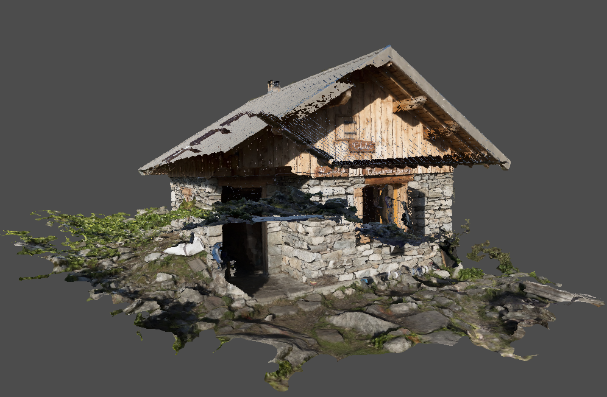
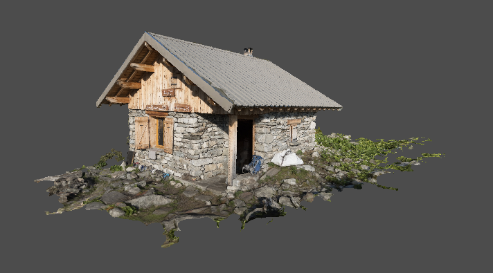

---

## Contents

- [Overview](#overview)
- [Camera](#camera)
- [Depth Buffer](#depth-buffer)
- [Improvements](#improvements)

---

## Overview

In this chapter we will render the chalet model constructed previously and resolve various visual problems that arise.

First we introduce a _camera_ model and a builder for the drawing command.

Finally various improvements are made to simplify configuration of the presentation process.

---

## Framework

### Camera

Since we are now dealing with a model that has a specific orientation, the current view-transform matrix is encapsulated into a new _camera_ model that allows the application to more easily configure the view.  This will be extended in the next chapter to allow the camera to be dynamically controlled by the keyboard and mouse.

The camera is a model class representing the position and orientation of the viewer:

```java
public class Camera {
    private Point pos = Point.ORIGIN;
    private Vector dir = Axis.Z;
    private Vector up = Axis.Y;
}
```

Note that under the hood the camera direction is the inverse of the view direction, i.e. the camera points _out_ of the screen whereas the view is obviously into the screen.

Various mutators are provided to move the camera:

```java
public void move(Point pos) {
    this.pos = notNull(pos);
}

public void move(Vector vec) {
    pos = pos.add(vec);
}

public void move(float dist) {
    move(dir.multiply(dist));
}
```

And a convenience method points the camera at a given target:

```java
public void look(Point pt) {
    if(pos.equals(pt)) throw new IllegalArgumentException();
    Vector look = Axis.between(pt, pos).normalize();
    direction(look);
}
```

Where `between` is a new factory method on the vector class:

```java
public static Vector between(Point start, Point end) {
    float dx = end.x - start.x;
    float dy = end.y - start.y;
    float dz = end.z - start.z;
    return new Vector(dx, dy, dz);
}
```

Note that this camera model is subject to gimbal locking, e.g. if the direction is set to the _up_ axis.  Validation is added (not shown) to the relevant setters to prevent this occurring.  Later on we will replace the _direction_ property with a more advanced implementation for the camera orientation to mitigate this problem.

Next the following transient members are added to the camera class to support the view transform:

```java
public class Camera {
    ...
    private Vector right = Axis.X;
    private Matrix matrix;
    private boolean dirty = true;
}
```

Where:

* The `dirty` flag is signalled in the various mutator methods (not shown) when any of the camera properties are modified.

* The `right` vector is the horizontal axis of the viewport (also used in the `strafe` method).

The view transform matrix for the camera is constructed on demand:

```java
public Matrix matrix() {
    if(dirty) {
        update();
        dirty = false;
    }
    return matrix;
}
```

The `update` method first determines the viewport axes based on the camera axes:

```java
private void update() {
    // Determine right axis
    right = up.cross(dir).normalize();

    // Determine up axis
    Vector y = dir.cross(right).normalize();
}
```

And finally the matrix is constructed from the translation and rotation components as before:

```java
// Build translation component
Matrix trans = Matrix.translation(new Vector(pos));

// Build rotation component
Matrix rot = new Matrix.Builder()
    .identity()
    .row(0, right)
    .row(1, y)
    .row(2, dir)
    .build();

// Create camera matrix
matrix = rot.multiply(trans);
```

The _cross product_ yields the vector perpendicular to two other vectors (using the right-hand rule):

```java
public Vector cross(Vector vec) {
    float x = this.y * vec.z - this.z * vec.y;
    float y = this.z * vec.x - this.x * vec.z;
    float z = this.x * vec.y - this.y * vec.x;
    return new Vector(x, y, z);
}
```

Many operations assume that a vector has been _normalized_ to _unit length_ (with possibly undefined results if the assumption is invalid).  This responsibility is left to the application which can use the following method to normalize a vector as required:

```java
public Vector normalize() {
    float len = magnitude();
    if(MathsUtil.isEqual(1, len)) {
        return this;
    }
    else {
        float f = MathsUtil.inverseRoot(len);
        return multiply(f);
    }
}
```

Where `multiply` scales a vector by a given value:

```java
public Vector multiply(float f) {
    return new Vector(x * f, y * f, z * f);
}
```

A vector has a _magnitude_ (or length) which is calculated using the _Pythagorean_ theorem as the square-root of the _hypotenuse_ of the vector.  Although square-root operations are generally delegated to the hardware and are therefore less expensive than in the past, we prefer to avoid having to perform roots where possible.  Additionally many algorithms work irrespective of whether the distance is squared or not.

Therefore the `magnitude` is expressed as the __squared__ length of the vector (which is highlighted in the documentation):

```java
/**
 * @return Magnitude (or length) <b>squared</b> of this vector
 */
public float magnitude() {
    return x * x + y * y + z * z;
}
```

Note that the vector class is immutable and all 'mutator' methods create a new instance.

### Draw Command

The draw command will need to be updated for the indexed model, we take the opportunity to implement a convenience builder on the `DrawCommand` class:

```java
public static class Builder {
    private boolean indexed;
    private int count;
    private int firstVertex;
    private int firstIndex;
    private int instanceCount = 1;
    private int firstInstance;
}
```

The build method selects the appropriate command variant depending on the supplied arguments:

```java
public DrawCommand build() {
    if(indexed) {
        return (api, buffer) -> api.vkCmdDrawIndexed(buffer, count, instanceCount, firstIndex, firstVertex, firstInstance);
    }
    else {
        return (api, buffer) -> api.vkCmdDraw(buffer, count, instanceCount, firstVertex, firstInstance);
    }
}
```

Convenience factory methods are added for common use-cases:

```java
static DrawCommand draw(int count) {
    return new Builder().count(count).build();
}

static DrawCommand indexed(int count) {
    return new Builder().indexed(0).count(count).build();
}
```

Finally a further helper is implemented to create a draw command for a given model:

```java
static DrawCommand of(Model model) {
    int count = model.header().count();
    if(model.index().isPresent()) {
        return indexed(count);
    }
    else {
        return draw(count);
    }
}
```

The hard-coded draw command can now be replaced in the render sequence:

```java
Command draw = DrawCommand.of(model);
```

---

## Depth Buffer

### Integration #1

A new `ModelDemo` project is started based on the previous rotating cube demo, minus the rotation animation.

The existing view-transform code is replaced with a camera:

```java
public class CameraConfiguration {
    @Bean
    public static Camera camera() {
        Camera cam = new Camera();
        cam.move(new Point(0, -0.5f, -2));
        return cam;
    }
}
```

And the matrix bean is refactored accordingly:

```java
return projection.multiply(cam.matrix()).multiply(model);
```

The previous VBO configuration is replaced with a new class that loads the persisted model:

```java
@Configuration
public class ModelConfiguration {
    @Autowired private LogicalDevice dev;
    @Autowired private AllocationService allocator;
    @Autowired private Pool graphics;

    @Bean
    public static Model model(DataSource src) {
        var loader = new ResourceLoaderAdapter<>(src, new ModelLoader());
        return loader.load("chalet.model");
    }
}
```

Then the VBO and index buffer objects are created for the model:

```java
@Bean
public VertexBuffer vbo(Model model) {
    VulkanBuffer buffer = buffer(model.vertices(), VkBufferUsage.VERTEX_BUFFER);
    return new VertexBuffer(buffer);
}

@Bean
public IndexBuffer index(Model model) {
    VulkanBuffer buffer = buffer(model.index().get(), VkBufferUsage.INDEX_BUFFER);
    return new IndexBuffer(buffer, VkIndexType.UINT32);
}
```

Which both delegate to the following helper:

```java
private VulkanBuffer buffer(Bufferable data, VkBufferUsage usage) {
    // Create staging buffer
    VulkanBuffer staging = VulkanBuffer.staging(dev, allocator, data);

    // Init buffer memory properties
    var props = new MemoryProperties.Builder<VkBufferUsage>()
        .usage(VkBufferUsage.TRANSFER_DST)
        .usage(usage)
        .required(VkMemoryProperty.DEVICE_LOCAL)
        .build();

    // Create buffer
    VulkanBuffer buffer = VulkanBuffer.create(dev, allocator, staging.length(), props);

    // Copy staging to buffer
    staging.copy(buffer).submit(graphics);

    // Release staging
    staging.destroy();

    return buffer;
}
```

And the index is bound in the render configuration:

```java
@Bean("index.bind")
static Command index(IndexBuffer index) {
    return index.bind(0);
}
```

Finally the `update` method is refactored as follows:

```java
@Bean
public FrameListener update(ResourceBuffer uniform) {
    return (start, end) -> {
        Matrix tilt = Rotation.of(Axis.X, MathsUtil.toRadians(-90)).matrix();
        Matrix rot = Rotation.of(Axis.Y, MathsUtil.toRadians(120)).matrix();
        Matrix model = rot.multiply(tilt);
        Matrix matrix = projection.multiply(cam.matrix()).multiply(model);
        matrix.buffer(uniform.buffer());
    };
}
```

The default camera configuration means we are looking at the model from above, therefore the `model` component of the matrix is introduced where:

* The _tilt_ sets the orientation of the model so we are looking at it from the side.

* And _rot_ rotates vertically so the camera is facing the corner of the chalet with the door.

* Note that the camera was also moved slightly above 'ground' level.

When we run the demo the results are a bit of a mess:


There are a couple of issues here but the most obvious is that the texture appears to be upside down, the grass is obviously on the roof and vice-versa.

### Texture Coordinate Invert

The upside-down texture is due to the fact that OBJ texture coordinates (and OpenGL) assume an origin at the bottom-left of the image, whereas for Vulkan the 'start' of the texture image is the top-left corner.

We _could_ fiddle the texture coordinates in the shader, or flip the texture using an editor application, or invert it programatically at load time.  However none of these resolve the actual root problem, flipping the image would just add extra effort, and inverting at runtime would only make loading slower.  Instead the vertical texture coordinate is flipped _once_ when the OBJ model is first loaded.

The following adapter method flips the vertical component of each texture coordinate:

```java
private static Coordinate2D flip(float[] array) {
    assert array.length == 2;
    return new Coordinate2D(array[0], -array[1]);
}
```

And the parser in the OBJ loader is updated accordingly:

```java
add("vt", new VertexComponentParser<>(2, ObjectModelLoader::flip, model.coordinates()));
```

We assume that this will apply to all OBJ models, it can always be made an optional feature if that assumption turns out to be incorrect.

After regenerating the model it now looks to be textured correctly, in particular the signs on the front of the chalet are the right way round (so the model is not being rendered inside-out for example):



### Depth-Stencil Pipeline Stage

The second problem is that fragments are being rendered arbitrarily overlapping, either the geometry needs to be ordered by distance from the camera, or the _depth test_ is enabled to ensure that obscured fragments are ignored.  The depth test uses the _depth buffer_ which is a special attachment that records the distance of each rendered fragment, discarding subsequent fragments that are closer to the camera.

The depth test is configured by a new pipeline stage:

```java
public class DepthStencilStageBuilder extends AbstractPipelineBuilder<VkPipelineDepthStencilStateCreateInfo> {
    private final VkPipelineDepthStencilStateCreateInfo info = new VkPipelineDepthStencilStateCreateInfo();

    public DepthStencilStageBuilder() {
        enable(false);
        write(true);
        compare(VkCompareOp.LESS_OR_EQUAL);
    }
}
```

In the previous demos the clear value for the colour attachments was hard-coded, with the addition of the depth buffer this functionality now needs to be properly implemented.

Introducing clear values should have been easy, however there was a nasty surprise when adding the depth-stencil to the demo, with JNA throwing the infamous `Invalid memory access` error.  Eventually we realised that `VkClearValue` and `VkClearColorValue` are in fact __unions__ and not structures.  Presumably the original code with a single clear value only worked by luck because the properties for a colour attachment happen to be the first field in each object, i.e. the `color` and `float32` properties.

Thankfully JNA supports unions out-of-the-box, the generated code was manually modified as unions.

A clear value is defined by the following abstraction:

```java
public sealed interface ClearValue permits ColourClearValue, DepthClearValue {
    /**
     * Populates the given clear value descriptor.
     * @param value Descriptor
     */
    void populate(VkClearValue value);
}
```

The temporary code can now be moved to a new implementation for colour attachments:

```java
record ColourClearValue(Colour col) implements ClearValue {
    @Override
    public void populate(VkClearValue value) {
        value.setType("color");
        value.color.setType("float32");
        value.color.float32 = col.toArray();
    }
}
```

The `setType` method of a JNA union is used to 'select' the relevant properties.  

A second implementation is added for the depth-stencil attachment:

```java
record DepthClearValue(Percentile depth) implements ClearValue {
    /**
     * Default clear value for a depth attachment.
     */
    public static final DepthClearValue DEFAULT = new DepthClearValue(Percentile.ONE);

    @Override
    public void populate(VkClearValue value) {
        value.setType("depthStencil");
        value.depthStencil.depth = depth.floatValue();
        value.depthStencil.stencil = 0;
    }
}
```

As far as we can tell this is the __only__ instance in the whole Vulkan API that uses unions!

The clear value now becomes a mutable property of the image view:

```java
public class View extends AbstractVulkanObject {
    private ClearValue clear;

    public Optional<ClearValue> clear() {
        return Optional.ofNullable(clear);
    }

    public View clear(ClearValue clear) {
        this.clear = clear;
        return this;
    }
}
```

The builder for the swapchain class is also refactored to conveniently initialise a clear colour for all swapchain images.

Finally the `begin` method of the frame buffer is updated to populate the clear values at the start of the render-pass:

```java
// Enumerate clear values
Collection<ClearValue> clear = attachments
    .stream()
    .map(View::clear)
    .flatMap(Optional::stream)
    .toList();

// Init clear values
info.clearValueCount = clear.size();
info.pClearValues = StructureHelper.pointer(clear, VkClearValue::new, ClearValue::populate);
```

### Integration #2

To use the depth test in the demo a new depth-stencil attachment is added to the render-pass configuration:

```java
Attachment colour = ...

Attachment depth = new Attachment.Builder()
    .format(VkFormat.D32_SFLOAT)
    .load(VkAttachmentLoadOp.CLEAR)
    .finalLayout(VkImageLayout.DEPTH_STENCIL_ATTACHMENT_OPTIMAL)
    .build();

Subpass subpass = new Subpass.Builder()
    .colour(colour)
    .depth(depth, VkImageLayout.DEPTH_STENCIL_ATTACHMENT_OPTIMAL)
    ...
```

Notes:

* The format of the depth buffer attachment is temporarily hard-coded to one that is commonly available on most Vulkan implementations.

* The _store_ operation is left as the `DONT_CARE` default.

* Similarly the _old layout_ property is `UNDEFINED` since the previous contents are not relevant.

Unlike the swapchain images the application is responsible for creating and managing the image for the depth buffer attachment:

```java
@Bean
public View depth(Swapchain swapchain, AllocationService allocator) {
    Descriptor descriptor = new Descriptor.Builder()
        .aspect(VkImageAspect.DEPTH)
        .extents(swapchain.extents())
        .format(VkFormat.D32_SFLOAT)
        .build();
        
    ...
}
```

Next the image for the depth attachment is instantiated:

```java
var props = new MemoryProperties.Builder<VkImageUsageFlag>()
    .usage(VkImageUsageFlag.DEPTH_STENCIL_ATTACHMENT)
    .required(VkMemoryProperty.DEVICE_LOCAL)
    .build();

Image image = new Image.Builder()
    .descriptor(descriptor)
    .tiling(VkImageTiling.OPTIMAL)
    .properties(props)
    .build(dev, allocator);
```

And a view is created with a depth clear value:

```java
return View.of(image).clear(DepthClearValue.DEFAULT);
```

The depth buffer is then added to each frame buffer along with the colour attachment:

```java
@Bean
public static FrameSet frames(Swapchain swapchain, RenderPass pass, View depth) {
    return new FrameSet(swapchain, pass, List.of(depth));
}
```

Finally the depth test is enabled in the pipeline configuration:

```java
.depth()
    .enable(true)
    .build()
```

Notes:

* Depth buffer images do not need to be programatically transitioned as Vulkan automatically manages the image during the render pass.

* The same depth buffer can safely be used in each frame since only a single sub-pass will be executing at any one time in the current render loop.

With the depth buffer enabled we should finally be able to see the chalet model:



Ta-da!

---

## Improvements

### Format Selector

Rather than hard-coding the format of the depth buffer the following helper is implemented to select a suitable format from a list of candidates:

```java
public class FormatSelector {
    private final PhysicalDevice dev;
    private final Predicate<VkFormatProperties> filter;

    public Optional<VkFormat> select(List<VkFormat> candidates) {
        return candidates.stream().filter(this::matches).findAny();
    }
}
```

The `matches` method looks up the properties of each candidate from the device and applies the predicate:

```java
private boolean matches(VkFormat format) {
    VkFormatProperties props = dev.properties(format);
    return filter.test(props);
}
```

The following factory method creates a format predicate for optimal or linear tiling features:

```java
public static Predicate<VkFormatProperties> filter(boolean optimal, Set<VkFormatFeature> features) {
    Mask mask = new Mask(IntegerEnumeration.reduce(features));
    return props -> {
        int bits = optimal ? props.optimalTilingFeatures : props.linearTilingFeatures;
        return mask.matches(bits);
    };
}
```

Where `Mask` is a new utility class for common bit-level operations:

```java
public record Mask(int mask) {
    public boolean matches(int bits) {
        return (mask & bits) == mask;
    }
}
```

A convenience constructor (not shown) is also added to create a selector using the `filter` factory method.

The optimal format can now be selected in the demo when configuring the depth buffer:

```java
@Bean
public View depth(Swapchain swapchain, AllocationService allocator) {
    FormatSelector selector = new FormatSelector(dev.parent(), true, VkFormatFeature.DEPTH_STENCIL_ATTACHMENT);
    VkFormat format = selector.select(VkFormat.D32_SFLOAT, VkFormat.D32_SFLOAT_S8_UINT, VkFormat.D24_UNORM_S8_UINT).orElseThrow();
    ...
}
```

### Swapchain Configuration

We also make some modifications to the configuration of the swapchain to select various properties rather than hard-coding.

First the following helper is added to the surface class to select an image format, falling back to a default format if the requested configuration is not available:

```java
public VkSurfaceFormatKHR format(VkFormat format, VkColorSpaceKHR space, VkSurfaceFormatKHR def) {
    return this
        .formats()
        .stream()
        .filter(f -> f.format == format)
        .filter(f -> f.colorSpace == space)
        .findAny()
        .or(() -> Optional.ofNullable(def))
        .orElseGet(Surface::defaultSurfaceFormat);
}
```

Where the following factory creates the commonly supported default format:

```java
public static VkSurfaceFormatKHR defaultSurfaceFormat() {
    // Create surface format
    var format = new VkSurfaceFormatKHR();
    format.colorSpace = VkColorSpaceKHR.SRGB_NONLINEAR_KHR;

    // Init default swapchain image format
    format.format = new FormatBuilder()
            .components("BGRA")
            .bytes(1)
            .signed(false)
            .type(FormatBuilder.Type.NORM)
            .build();

    return format;
}
```

A second helper is added to select a preferred presentation mode:

```java
public VkPresentModeKHR mode(VkPresentModeKHR... modes) {
    Set<VkPresentModeKHR> available = this.modes();
    return Arrays
            .stream(modes)
            .filter(available::contains)
            .findAny()
            .orElse(DEFAULT_PRESENTATION_MODE);
}
```

The configuration of the swapchain is now more robust:

```java
public Swapchain swapchain(Surface surface, ApplicationConfiguration cfg) {
    // Select presentation mode
    VkPresentModeKHR mode = surface.mode(VkPresentModeKHR.MAILBOX_KHR);

    // Select SRGB surface format
    VkSurfaceFormatKHR format = surface.format(VkFormat.B8G8R8_UNORM, VkColorSpaceKHR.SRGB_NONLINEAR_KHR, null);

    // Create swapchain
    return new Swapchain.Builder(dev, surface)
        .count(cfg.getFrameCount())
        .clear(cfg.getBackground())
        .format(format)
        .presentation(mode)
        .build();
}
```

Finally the surface property accessors can be cached to minimise API calls:

```java
public Surface cached() {
    return new Surface(handle, dev) {
        private final Supplier<VkSurfaceCapabilitiesKHR> caps = new LazySupplier<>(super::capabilities);
        private final Supplier<List<VkSurfaceFormatKHR>> formats = new LazySupplier<>(super::formats);
        private final Supplier<Set<VkPresentModeKHR>> modes = new LazySupplier<>(super::modes);

        @Override
        public VkSurfaceCapabilitiesKHR capabilities() {
            return caps.get();
        }
        
        ...
    };
}
```

Where `LazySupplier` returns a singleton instance using a relatively cheap thread-safe implementation.

### Global Flip

By default the Vulkan Y axis points __down__ which is the opposite direction to OpenGL (and just about every other 3D library).

However we came across a global solution that handily flips the axis by specifying a 'negative' viewport rectangle: [Flipping the Vulkan viewport](https://www.saschawillems.de/blog/2019/03/29/flipping-the-vulkan-viewport/)

The implementation is relatively trivial - we add a _flip_ setting to the `ViewportStageBuilder` which is applied when the viewport descriptor is populated:

```java
private void populate(Viewport viewport, VkViewport info) {
    Rectangle rect = viewport.rect;
    info.x = rect.x();
    info.width = rect.width();
    if(flip) {
        info.y = rect.y() + rect.height();
        info.height = -rect.height();
    }
    else {
        info.y = rect.y();
        info.height = rect.height();
    }
    ...
}
```

Notes:

* This solution is only supported in Vulkan version 1.1.x or above.

* The Y coordinate of the viewport origin is also shifted to the bottom of the viewport.

However we eventually decided against using the global flip as the default setting for a couple of reasons:

1. This is a breaking change for existing code since flipping the Y axis also essentially flips the triangle winding order.

2. The implementation actually flips the _coordinate space_ rather than simply flipping the frame buffer.  This means that __all__ code still needs to be aware that the global flip is enabled (e.g. for the camera model and view transform later on) which seems to defeat the object.

Therefore the _flip_ setting is disabled by default and we just accept that the Y direction is __down__ from this point forwards.

---

## Summary

In this chapter we implemented:

- The camera model.

- A builder for draw commands.

- The depth-stencil pipeline stage.

- A mechanism to clear colour and depth-stencil attachments.

- Texture coordinate inversion for OBJ models.

