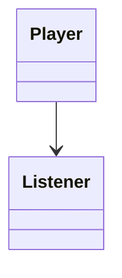

---

## Contents

- [Overview](#overview)
- [Refactoring](#refactoring)
- [Animation](#animation)
- [Synchronisation](#synchronisation)

---

## Overview

Before we start the next demo application there are several issues with the existing, crude render loop we have implemented so far.

In no particular order:

* The rendering code is completely single-threaded (by blocking the work queues).

* The window event queue is blocked.

* There is no mechanism to terminate the application (other than the timer code or force-quitting the process).

* The code mixes up the following:
    * The Vulkan rendering process
    * The application logic to update the rotation
    * And the code to control the loop (the dodgy timer)

In this chapter we will address these issues by implementing the following:

* New reusable components to separate the rendering process and the application logic.

* A GLFW keyboard handler to gracefully exit the application.

* New reusable framework code for the rotation animation.

* Synchronisation to fully utilise the multi-threaded nature of the Vulkan pipeline.

---

## Refactoring

### Render Loop

We start by factoring out the render loop which is comprised of a mutable lists of _tasks_ to be executed on the main application thread:

```java
public class RenderLoop {
    @FunctionalInterface
    public interface Task {
        void execute();
    }

    private final List<Task> tasks = new ArrayList<>();
    private final volatile boolean running;
}
```

The loop repeatedly iterates through the tasks:

```java
public void run() {
    running = true;
    while(running) {
        tasks.forEach(Task::execute);
    }
}
```

And can be terminated by another thread:

```java
public void stop() {
    if(!running) throw new IllegalStateException(...);
    running = false;
}
```

We can now factor out the acquire-render-present rendering steps to a task:

```java
public class RenderTask implements Task {
    private final Swapchain swapchain;
    private final IntFunction<Buffer> factory;
    private final Queue presentation;

    @Override
    public void execute() {
        ...
    }
}
```

And modify the existing render loop bean accordingly:

```java
public static Task render(...) {
    return new RenderTask(swapchain, buffers::get, presentation.queue());
}
```

Finally we factor out the rotation logic into another task and delete the original code:

```java
@Bean
public static Task update(Matrix matrix, ResourceBuffer uniform, ApplicationConfiguration cfg) {
    long period = cfg.getPeriod();
    long start = System.currentTimeMillis();
    return () -> {
        ...
        uniform.load(m);
    };
}
```

### Graceful Exit

To gracefully exit the application loop we add a GLFW key listener in the main class that stops the application when the ESCAPE key is pressed:

```java
@Bean
public static KeyListener listener(Window window, Application app) {
    KeyListener listener = (ptr, key, scancode, action, mods) -> {
        if(key == 256) {
            app.stop();
        }
    };
    
    ...
    
    return listener;
}
```

The listener is a GLFW callback defined as follows:

```java
interface DesktopLibraryDevice {
    interface KeyListener extends Callback {
        /**
         * Notifies a key event.
         * @param window            Window
         * @param key               Key index
         * @param scancode          Key scan code
         * @param action            Key action
         * @param mods              Modifiers
         */
        void key(Pointer window, int key, int scancode, int action, int mods);
    }

    void glfwSetKeyCallback(Window window, KeyListener listener);
}
```

Finally the listener is registered on the window:

```java
Desktop desktop = window.desktop();
desktop.library().glfwSetKeyCallback(window.handle(), listener);
```

Notes:

* We will replace this code with a more comprehensive event handling framework later.

* For the moment we hard-code the ESCAPE key.

* Although not used elsewhere in the application the listener is registered with the container to prevent it being garbage collected (and unregistered by GLFW).

A complication of particular importance is that GLFW event processing __must__ be performed on the main application thread.  Therefore the application loop cannot be a separate thread or implemented using the task executor framework (for example).

We add another task to process the GLFW window event queue on the main thread:

```java
class DesktopConfiguration {
    @Bean
    public static Task poll(Desktop desktop) {
        return desktop::poll;
    }
}
```

Note that GLFW does not return any errors or exceptions if a thread-safe method is not invoked on the main thread.  See the [GLFW thread documentation](https://www.glfw.org/docs/latest/intro.html#thread_safety) for more details.

### Frame Tracker

This seems a convenient point to introduce support for frame event tracking.

The following new task delegates frame updates to interested listeners:

```java
public class FrameTracker implements RenderLoop.Task {
    public interface Listener {
        /**
         * Notifies a new frame.
         * @param tracker Frame tracker
         */
        void update(FrameTracker tracker);
    }

    private static long now() {
        return System.nanoTime();
    }

    private final Set<Listener> listeners = new HashSet<>();
    private long time = now();
    private long elapsed;
}
```

The frame tracker calculates the time elapsed since the previous frame (in nanoseconds) and notifies the attached listeners:

```java
public void execute() {
    // Update times
    final long now = now();
    elapsed = now - time;
    time = now;

    // Notify listeners
    for(Listener listener : listeners) {
        listener.update(this);
    }
}
```

We can now implement a simple FPS (frames-per-second) tracker:

```java
public class FrameCounter implements FrameTracker.Listener {
    private static final long SECOND = TimeUnit.SECONDS.toNanos(1);

    private long time;
    private int count;
    private int current;

    @Override
    public void update(FrameTracker tracker) {
        // Increment
        time += tracker.elapsed();
        ++current;
    
        // Reset after each second
        if(time >= SECOND) {
            count = current;
            current = 0;
            time = 0;
        }
    }
}
```

We also provide another implementation that throttles the number of frames-per-second by sleeping the thread:

```java
public class FrameThrottle implements FrameTracker.Listener {
    private long duration;

    public FrameThrottle() {
        throttle(50);
    }

    /**
     * Sets the target throttle rate.
     * @param fps Target frames-per-second (default is 50)
     */
    public void throttle(int fps) {
        this.duration = TimeUnit.SECONDS.toNanos(1) / fps;
    }

    @Override
    public void update(FrameTracker tracker) {
        final long sleep = duration - tracker.elapsed();
        if(sleep > 0) {
            LockSupport.parkNanos(duration);
        }
    }
}
```

Both of these implementations are quite crude but do the job.

### Integration

To integrate the above in the demo we first instantiate a render loop in the main class:

```java
@Bean
public static RenderLoop application(List<Task> tasks) {
    return new RenderLoop(tasks);
}
```

Spring handily creates the list for us from __all__ instances of `Task` registered in the container.

We add a new local component to start the loop:

```java
@Component
static class ApplicationLoop implements CommandLineRunner {
    private final RenderLoop loop;
    private final LogicalDevice dev;

    public ApplicationLoop(RenderLoop loop, LogicalDevice dev) {
        this.app = app;
        this.dev = dev;
    }

    @Override
    public void run(String... args) throws Exception {
        app.run();
        dev.waitIdle();
    }
}
```

Notes:

* Here we use `@Component` which defines a class to be instantiated by the container.

* We also add a `waitIdle` call after the loop has finished to correctly cleanup Vulkan resources.

When we now run the demo we should finally be able to move the window and close the application gracefully.

---

## Animation

### Playable Media





To apply a rotation animation to the cube demo we will implement the following new supporting framework classes that build on the matrix and frame listener functionality:

```
classDiagram

class State {
    <<enumeration>>
    PLAY
    PAUSE
    STOP
}

class Playable {
    <<interface>>
    +state(State)
    +isPlaying()
    +repeat(boolean)
}

Playable <|.. Player
Player : -boolean repeat
Player --> State
Player *--> "*" Listener 

class Listener {
    <<interface>>
    +update(State)
}

Player <|-- MediaPlayer
MediaPlayer --> Playable
```

First the following new base-class controller is introduced for managing objects or media that can be played:

```java
public class Player implements Playable {
    /**
     * Playable states.
     */
    enum State {
        PLAY,
        PAUSE,
        STOP
    }

    private final Collection<Listener> listeners = new HashSet<>();
    private State state = State.STOP;
    private boolean repeat;
}
```

The player implements the _observer_ pattern to notify state change transitions:

```java
@FunctionalInterface
public interface Listener {
    /**
     * Notifies a player state change.
     * @param state New state
     */
    void update(State state);
}
```

The player is a simple state-machine that validates transitions and notifies the attached listeners:

```java
public void state(State state) {
    // Update state
    state.validate(this.state);
    this.state = notNull(state);

    // Notify listeners
    for(Listener listener : listeners) {
        listener.update(state);
    }
}
```

Next we introduce the following abstraction for playable media such as audio files:

```java
public interface Playable {
    /**
     * Sets the state of this playable.
     * @param state New state
     */
    void state(State state);

    /**
     * @return Whether this playable is playing
     */
    boolean isPlaying();

    /**
     * Sets whether this playable should repeat.
     * @param repeat Whether repeating
     */
    void repeat(boolean repeat);
}
```

A more specialised player implementation is provided for playable media such as audio files:

```java
public class MediaPlayer extends Player {
    private final Playable playable;

    private void update() {
        if(isPlaying() && !playable.isPlaying()) {
            super.state(State.STOP);
        }
    }
}
```

Some playable objects may stop playing in the background (e.g. an OpenAL audio file running on a separate thread), the local `update` method checks whether the media has stopped since the last invocation, this check is applied in the various public methods of the player.

### Animation

An _animator_ is a second player specialisation for an _animation_ that is updated per frame:

```java
public class Animator extends Player implements FrameTracker.Listener {
    /**
     * An <i>animation</i> is updated by this animator.
     */
    @FunctionalInterface
    public interface Animation {
        /**
         * Updates this animation.
         * @param animator Animator
         */
        void update(Animator animator);
    }

    private final long duration;
    private final Animation animation;

    private long time;
    private float speed = 1;
}
```

The `update` method of the animator first checks whether the animation is currently playing:

```java
@Override
public void update(FrameTracker tracker) {
    if(!isPlaying()) {
        return;
    }
    ...
}
```

Next the _time_ position within the duration of the animation is calculated from the frame update:

```java
time += speed * TimeUnit.NANOSECONDS.toMillis(tracker.elapsed());
```

At the end of the animation the position is clamped to the duration or stops if the player is not configured to repeat:

```java
if(time > duration) {
    if(isRepeating()) {
        time = time % duration;
    }
    else {
        time = duration;
        state(Player.State.STOP);
    }
}
```

Finally the animation is updated to the new position:

```java
animation.update(this);
```

### Rotation Animation

The second new abstraction defines an arbitrary view _transform_ that is implemented as a matrix:

```java
@FunctionalInterface
public interface Transform {
    /**
     * @return Transformation matrix
     */
    Matrix matrix();

    /**
     * @return Whether this transform has changed (default is {@code false})
     */
    default boolean isDirty() {
        return false;
    }
}
```

A _rotation_ is a transform comprised of an axis-angle:

```java
public interface Rotation extends Transform {
    /**
     * @return Rotation axis
     */
    Vector axis();

    /**
     * @return Counter-clockwise rotation angle (radians)
     */
    float angle();

    /**
     * Creates a matrix for the given rotation.
     * @param rot Rotation
     * @return New rotation matrix
     * @throws UnsupportedOperationException for an <i>arbitrary</i> axis
     * @see Quaternion#of(Rotation)
     */
    static Matrix matrix(Vector axis, float angle) {
        ...
    }
}
```

Note that the rotation `matrix` factory method is moved here since it more logically sits in the new class.

Simple fixed rotations are represented by the following default implementation:

```java
class DefaultRotation extends AbstractRotation {
    private final Matrix matrix;

    public DefaultRotation(Vector axis, float angle) {
        super(axis, angle);
        this.matrix = Rotation.matrix(axis, angle);
    }

    @Override
    public Matrix matrix() {
        return matrix;
    }
}
```

A second implementation is added for a mutable axis-angle rotation:

```java
public class MutableRotation extends AbstractRotation {
    private boolean dirty = true;

    public MutableRotation(Vector axis) {
        super(axis, 0);
    }

    /**
     * Sets the rotation angle.
     * @param angle Rotation angle (radians)
     */
    public void angle(float angle) {
        this.angle = angle;
        dirty = true;
    }

    @Override
    public boolean isDirty() {
        return dirty;
    }

    @Override
    public Matrix matrix() {
        dirty = false;
        return Quaternion.of(this).matrix();
    }
}
```

Note that here the matrix is calculated used a _quaternion_ (detailed below) which supports arbitrary rotation axes.

Finally the following adapter composes the new mutable implementation and animates the rotation angle about the unit-circle:

```java
public class RotationAnimation implements Animation {
    private final MutableRotation rot;

    @Override
    public void update(Animator animator) {
        float angle = animator.position() * MathsUtil.TWO_PI;
        rot.angle(angle);
    }
}
```

The animation framework is illustrated in the following class diagram:

```
classDiagram

class Animator {
    -long duration
    -long time
    -float speed
}
Player <|-- Animator

class Animation {
    <<interface>>
    +update(Animator)
}
Animator --> Animation

Animation <|.. RotationAnimation

class Transform {
    <<interface>>
    +matrix() Matrix
}

class Rotation {
    <<interface>>
}
Transform <|-- Rotation

Rotation <|.. MutableRotation
MutableRotation <-- RotationAnimation
```

### Quaternions

A _quaternion_ is more compact and efficient representation of a rotation but is less intuitive to use and comprehend.

See [Wikipedia](https://en.wikipedia.org/wiki/Quaternions_and_spatial_rotation).

Generally we use quaternions to represents a rotation about an _arbitrary_ axis or where multiple rotations are frequently composed (e.g. for skeletal animation).

```java
public final class Quaternion implements Transform {
    public final float w, x, y, z;

    /**
     * @return Magnitude <b>squared</b> of this quaternion
     */
    public float magnitude() {
        return w * w + x * x + y * y + z * z;
    }
}
```

A quaternion can be constructed from an axis-angle rotation using the following factory:

```java
public static Quaternion of(Rotation rot) {
    float half = rot.angle() * MathsUtil.HALF;
    Vector vec = rot.axis().multiply(MathsUtil.sin(half));
    return new Quaternion(MathsUtil.cos(half), vec.x, vec.y, vec.z);
}
```

And converted back to a rotation in the inverse operation:

```java
public Rotation rotation() {
    float scale = MathsUtil.inverseRoot(1 - w * w);
    float angle = 2 * MathsUtil.acos(w);
    Vector axis = new Vector(x, y, z).multiply(scale);
    return new DefaultRotation(axis, angle);
}
```

Finally a matrix can be constructed from the quaternion as follows:

```java
public Matrix matrix() {
    float xx = x * x;
    float xy = x * y;
    float xz = x * z;
    float xw = x * w;
    float yy = y * y;
    float yz = y * z;
    float yw = y * w;
    float zz = z * z;
    float zw = z * w;

    return new Matrix.Builder()
        .identity()
        .set(0, 0, 1 - 2 * (yy + zz))
        .set(1, 0, 2 * (xy + zw))
        .set(2, 0, 2 * (xz - yw))
        .set(0, 1, 2 * (xy - zw))
        .set(1, 1, 1 - 2 * (xx + zz))
        .set(2, 1, 2 * (yz + xw))
        .set(0, 2, 2 * (xz + yw))
        .set(1, 2, 2 * (yz - xw))
        .set(2, 2, 1 - 2 * (xx + yy))
        .build();
}
```

### Integration

In the demo we add two new components for the rotation animation:

```java
@Bean
MutableRotation rotation() {
    return new MutableRotation(Vector.Y);
}

@Bean
Animator animator(MutableRotation rot) {
    Animator animator = new Animator(5000, new AnimationRotation(rot));
    animator.state(Animator.State.PLAY);
    return animator;
}
```

Note that Spring auto-magically registers the animator with the frame listener.

Finally the mutable rotation is injected into the `update` bean to update the modelview matrix and the crude hand-crafted animation code can now be removed.

A lot of work but now we have a decent animation framework for future demos.

---

## Synchronisation

### Semaphores

So far we have avoided synchronisation by simply blocking the device after rendering and presentation of a frame.  However Vulkan is designed to be multi-threaded from the ground up, in particular the following methods are asynchronous operations:

* Acquiring the next swapchain image

* Submitting a render task to the work queue

* Presentation of a rendered frame

All of these methods return immediately with the actual work queued for execution in the background.

The Vulkan API provides several synchronisation mechanisms that can be used by the application, a _semaphore_ is the simplest of these and is used to synchronise operations within or across work queues.  The class itself is trivial (since semaphores do not have any public functionality):

```java
public class Semaphore extends AbstractVulkanObject {
    private Semaphore(Pointer handle, DeviceContext dev) {
        super(handle, dev);
    }

    @Override
    protected Destructor<Semaphore> destructor(VulkanLibrary lib) {
        return lib::vkDestroySemaphore;
    }
}
```

A semaphore is created using a factory method:

```java
public static Semaphore create(DeviceContext dev) {
    VkSemaphoreCreateInfo info = new VkSemaphoreCreateInfo();
    VulkanLibrary lib = dev.library();
    PointerByReference handle = dev.factory().pointer();
    VulkanLibrary.check(lib.vkCreateSemaphore(dev, info, null, handle));
    return new Semaphore(handle.getValue(), dev);
}
```

We create two semaphores in the render loop to signal the following conditions:

1. An acquired swapchain image is `available` for rendering.

2. A frame has been rendered and is `ready` for presentation.

The semaphores are instantiated in the constructor:

```java
private final Semaphore available, ready;

public RenderLoop(Swapchain swapchain, ...) {
    DeviceContext dev = swapchain.device();
    available = Semaphore.create(dev);
    ready = Semaphore.create(dev);
}
```

We pass the _available_ semaphore to the acquire method which passes it on to the API method:

```java
int index = swapchain.acquire(available);
```

The _ready_ semaphore is passed to the presentation method:

```java
swapchain.present(presentation, Set.of(ready));
```

And the method is modified to populate the relevant member of the descriptor for the presentation operation:

```java
public void present(Queue queue, Set<Semaphore> semaphores) {
    ...
    info.waitSemaphoreCount = semaphores.size();
    info.pWaitSemaphores = NativeObject.toArray(semaphores);
    ...
}
```

Finally we release the semaphores when the render loop object is destroyed:

```java
public void close() {
    available.destroy();
    ready.destroy();
}
```

Note that here the cleanup method is named `close` to take advantage of the _inferred_ bean destructor method used by the Spring container.

If we run the demo as it now stands (with the work queue blocking still present) we will get additional errors because the semaphores are never actually signalled.

### Work Submission

To use the semaphores we extend the work class by adding two new members:

```java
public class Work {
    ...
    private final Map<Semaphore, Integer> wait = new LinkedHashMap<>();
    private final Set<Semaphore> signal = new HashSet<>();
}
```

Each entry in the `wait` table consists of:

* A semaphore that must be signalled before the work can be performed.

* The stages(s) of the pipeline to wait on (represented as an integer mask).

The `signal` member is the set of semaphores to be signalled when the work has completed.

We modify the builder to configure the semaphores for a work submission:

```java
public Builder wait(Semaphore semaphore, Collection<VkPipelineStage> stages) {
    wait.put(semaphore, IntegerEnumeration.mask(stages));
}

public Builder signal(Semaphore semaphore) {
    signal.add(semaphore);
}
```

And the populate method of the work class is updated to include the signals:

```java
info.signalSemaphoreCount = signal.size();
info.pSignalSemaphores = NativeObject.toArray(signal);
```

Population of the wait semaphores is slightly more complicated because the two components are separate fields (rather than an array of some child structure).  We first populate the pointer array for the semaphores:

```java
info.waitSemaphoreCount = wait.size();
info.pWaitSemaphores = NativeObject.toArray(wait.keySet());
```

And then the list of stage masks for each semaphore (which for some reason is a pointer-to-integer array):

```java
int[] stages = wait.values().stream().mapToInt(Integer::intValue).toArray();
Memory mem = new Memory(stages.length * Integer.BYTES);
mem.write(0, stages, 0, stages.length);
info.pWaitDstStageMask = mem;
```

Note that the `wait` table is a linked map so that the two fields have the same order.
  
We can now configure the work submission for the render task to use the semaphores:

```java
new Work.Builder(buffer.pool())
    .add(buffer)
    .wait(available, VkPipelineStage.COLOR_ATTACHMENT_OUTPUT)
    .signal(ready)
    .build()
    .submit();
```

This resolves the validation errors that were due to the semaphores never being signalled.

### Fence

However if one were to remove the `waitIdle` calls in the existing code the validation layer will again flood with errors - we are trying to use the command buffers concurrently for multiple frames.

Additionally the application is continually queueing up rendering work without checking whether it actually completes (which can be seen if one watches the memory usage).

To resolve both of these issues we introduce the second synchronisation mechanism known as a _fence_ which is used to synchronise between Vulkan and application code:

```java
public class Fence extends AbstractVulkanObject {
    @Override
    protected Destructor<Fence> destructor(VulkanLibrary lib) {
        return lib::vkDestroyFence;
    }
}
```

Again a fence is created using a factory:

```java
public static Fence create(DeviceContext dev, VkFenceCreateFlag... flags) {
    // Init descriptor
    VkFenceCreateInfo info = new VkFenceCreateInfo();
    info.flags = IntegerEnumeration.mask(flags);

    // Create fence
    VulkanLibrary lib = dev.library();
    PointerByReference handle = dev.factory().pointer();
    check(lib.vkCreateFence(dev, info, null, handle));

    // Create domain object
    return new Fence(handle.getValue(), dev);
}
```

A fence can be signalled in the same manner as a semaphore but can also be explicitly waited on by the application:

```java
public static void wait(DeviceContext dev, Collection<Fence> fences, boolean all, long timeout) {
    Pointer array = NativeObject.toArray(fences);
    VulkanLibrary lib = dev.library();
    check(lib.vkWaitForFences(dev, fences.size(), array, VulkanBoolean.of(all), timeout));
}
```

Where _all_ specifies whether to wait for any or all of the supplied fences and _timeout_ is expressed in milliseconds.

Signalled fences can also be reset:

```java
public static void reset(DeviceContext dev, Collection<Fence> fences) {
    Pointer array = NativeObject.toArray(fences);
    VulkanLibrary lib = dev.library();
    check(lib.vkResetFences(dev, fences.size(), array));
}
```

We provide convenience equivalents of these two methods for the fence instance itself:

```java
public void reset() {
    reset(device(), Set.of(this));
}

public void waitReady() {
    wait(device(), Set.of(this), true, Long.MAX_VALUE);
}
```

The state of the fence can also be queried:

```java
public boolean signalled() {
    DeviceContext dev = this.device();
    VulkanLibrary lib = dev.library();
    int result = lib.vkGetFenceStatus(dev, this);
    if(result == SUCCESS) {
        return true;
    }
    else
    if(result == NOT_SIGNALLED) {
        return false;
    }
    else {
        throw new VulkanException(result);
    }
}
```

We can now add a fence to the render loop component:

```java
fence = Fence.create(dev, VkFenceCreateFlag.SIGNALED);
```

At the start of the render loop we block on the fence to ensure the previous frame has completed, the fence is initialised to the signalled state for this reason.

After resetting the fence we then modify the work submission code to accept the fence, which just involves adding the parameter and passing it to the API:

```java
public static void submit(List<Work> work, Fence fence) {
    ...
    check(lib.vkQueueSubmit(pool.queue(), array.length, array, fence));
}
```

The refactored render loop now looks like this:

```java
// Wait for any previous work to complete
fence.waitReady();

// Retrieve next swapchain image index
final int index = swapchain.acquire(available, null);

// Clear synchronisation
fence.reset();

// Render frame
final Buffer buffer = factory.apply(index);
new Work.Builder(buffer.pool())
    .add(buffer)
    .wait(available, VkPipelineStage.COLOR_ATTACHMENT_OUTPUT)
    .signal(ready)
    .build()
    .submit(fence);

// Present frame
swapchain.present(presentation, index, Set.of(ready));
```

We also release the fence in the `close` method.

The demo should now run without validation errors (for the render loop anyway), however there are still further improvements we can implement.

### Sub-Pass Dependencies

The final synchronisation mechanism is a _subpass dependency_ that specifies memory and execution dependencies between the stages of a render-pass.

We first add a new transient data type to the sub-pass class that specifies a dependency:

```java
public record SubpassDependency(Subpass subpass, Dependency source, Dependency destination) {
    /**
     * A <i>dependency</i> specifies the properties for the source or destination component of this sub-pass dependency.
     */
    public static record Dependency(Set<VkPipelineStage> stages, Set<VkAccess> access) {
    }
}
```

Where _subpass_ is the dependant sub-pass and the _source_ and _destination_ specify the dependency properties.  

We add a new member for a list of `dependencies` to the sub-pass class and its builder.  Note that in our design the _destination_ is implicitly the sub-pass containing the dependency.

Next we add a new nested builder to configure a sub-pass dependency:

```java
public class SubpassDependencyBuilder {
    private final DependencyBuilder src = new DependencyBuilder();
    private final DependencyBuilder dest = new DependencyBuilder();
    private Subpass subpass;
}
```

The source and destination properties are essentially the same so we wrap these into yet another nested builder on the dependency builder:

```java
public class DependencyBuilder {
    private final Set<VkPipelineStage> stages = new HashSet<>();
    private final Set<VkAccess> access = new HashSet<>();
}
```

The build method constructs the dependency record and adds it to the list for the sub-pass:

```java
public Builder build() {
    SubpassDependency dependency = new SubpassDependency(subpass, src.create(), dest.create());
    dependencies.add(dependency);
    return Builder.this;
}
```

Finally we add a special case constant for the implicit sub-pass before and after the render-pass:

```java
public static final Subpass EXTERNAL = new Subpass() {
    @Override
    public String toString() {
        return "EXTERNAL";
    }
};
```

We modify the render pass builder to populate the dependencies:

```java
List<Entry<Subpass, SubpassDependency>> dependencies = subpasses.stream().flatMap(Helper::stream).collect(toList());
info.dependencyCount = dependencies.size();
info.pDependencies = StructureHelper.pointer(dependencies, VkSubpassDependency::new, this::dependency);
```

The purpose of the first line is to generate a flattened list of dependencies zipped up with the parent sub-pass (for which we use a map entry):

```java
private static Stream<Entry<Subpass, SubpassDependency>> stream(Subpass subpass) {
    return subpass
        .dependencies()
        .stream()
        .map(e -> Map.entry(subpass, e));
}
```

The reason for this somewhat ugly transformation is we need to lookup the indices of the source and destination sub-passes when we populate the descriptor for a dependency:

```java
private void dependency(Entry<Subpass, SubpassDependency> entry, VkSubpassDependency desc) {
    // Populate source properties
    final Dependency src = dependency.source();
    desc.srcSubpass = indexOf(dependency.subpass());
    desc.srcStageMask = IntegerEnumeration.mask(src.stages());
    desc.srcAccessMask = IntegerEnumeration.mask(src.access());

    // Populate destination properties
    final Dependency dest = dependency.destination();
    desc.dstSubpass = indexOf(entry.getKey());
    desc.dstStageMask = IntegerEnumeration.mask(dest.stages());
    desc.dstAccessMask = IntegerEnumeration.mask(dest.access());
}
```

The `indexOf` helper also handles the case for the implicit external sub-pass:

```java
private int indexOf(Subpass subpass) {
    if(subpass == Subpass.EXTERNAL) {
        return VK_SUBPASS_EXTERNAL;
    }

    int index = subpasses.indexOf(subpass);
    if(index == -1) throw new IllegalArgumentException(...);
    return index;
}
```

In the demo we can now configure a dependency between our single sub-pass and the implicit starting sub-pass:

```java
Subpass subpass = new Subpass.Builder()
    .colour(new Reference(attachment, VkImageLayout.COLOR_ATTACHMENT_OPTIMAL))
    .dependency()
        .subpass(Subpass.EXTERNAL)
        .source()
            .stage(VkPipelineStage.COLOR_ATTACHMENT_OUTPUT)
            .build()
        .destination()
            .stage(VkPipelineStage.COLOR_ATTACHMENT_OUTPUT)
            .access(VkAccess.COLOR_ATTACHMENT_WRITE)
            .build()
        .build()
    .build();
```

The _destination_ clause specifies that our sub-pass waits for the colour attachment to be ready for writing, i.e. we need to wait for the swapchain to finish using the image.

This should allow the application to more efficiently use the multi-threaded nature of the pipeline.

### Frames In-Flight

The render loop is still likely not fully utilising the pipeline since the code for a frame is essentially single-threaded - completed pipeline stages could be used to render the next frame.

Here we introduce multiple _in-flight_ frames to make better use of the pipeline whilst still bounding the overall amount of work.

We first wrap up the existing render code and the synchronisation primitives into an inner class representing an instance of an in-flight frame:

```java
private class Frame {
    private final Semaphore available, ready;
    private final Fence fence;

    private void render() {
        ...
    }
    
    private void destroy() {
        ...
    }
}
```

Next we add a new parameter to the constructor to instantiate the array of in-flight frames:

```java
public class RenderTask {
    private final Swapchain swapchain;
    private final Frame[] frames;
    private int current;

    public RenderTask(Swapchain swapchain, int count, Supplier<? extends Frame> factory) {
        this.frames = new Frame[count];
        for(int n = 0; n < count; ++n) {
            frames[n] = factory.get();
        }
    }
}
```

Note that the number of in-flight frames does not necessarily have to be the same as the number of swapchains images (though in practice this is generally the case).

The frames are also released on destruction:

```java
public void close() {
    for(Frame f : frames) {
        f.destroy();
    }
}
```

The main render loop is refactored to iterate through the array of in-flight frames on each invocation:

```java
public void run() {
    // Render next frame
    final Frame frame = frames[current];
    frame.render();

    // Move to next in-flight frame
    if(++current >= frames.length) {
        current = 0;
    }
}
```

Since the majority of the Vulkan methods are asynchronous we should now be able to process multiple in-flight frames in parallel, with the synchronisation implemented above bounding the work (we should no longer be seeing increasing memory usage).

There is one further potential failure case: if the number of in-flight frames is larger than the number of swapchain images and/or an image is acquired out-of-order we may end up rendering an image that is already in-flight.

To avoid this scenario we track the swapchain images that are actively in-flight:

```java
public class Swapchain extends AbstractVulkanObject {
    private final Fence[] active;

    public void waitReady(int index, Fence fence) {
        final Fence prev = active[index];
        if(prev != null) {
            prev.waitReady();
        }
        active[index] = fence;
    }
}
```

After acquiring the image index the in-flight frame invokes this method to additionally wait on the active image.

---

## Summary

In this chapter we:

- Factored out a reusable render loop component.

- Factored out the application loop.

- Integrated the GLFW window event queue and implemented a means of gracefully terminating the demo.

- Implemented new framework support for playable media and animations.

- Implemented synchronisation to ensure that the frame rendering is correctly synchronised within the pipeline and across the work queues.

