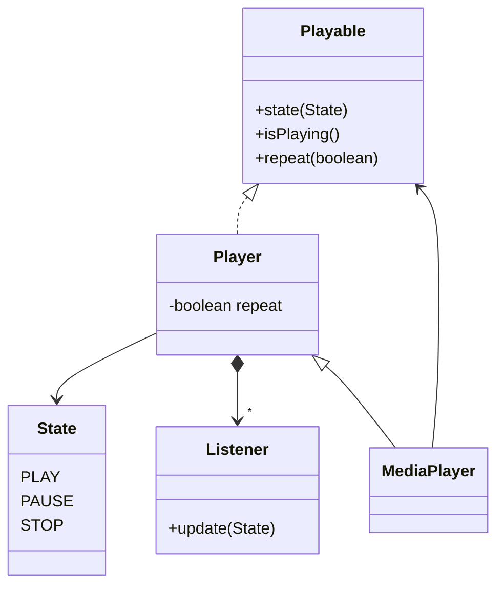
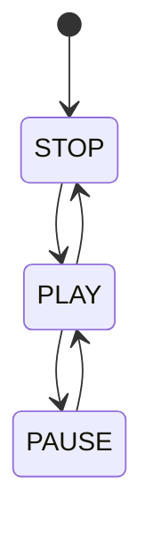

---

## Contents

- [Overview](#overview)
- [Render Loop](#render-loop)
- [Animation](#animation)
- [Synchronisation](#synchronisation)

---

## Overview

Before we progress the demo there are several issues with the existing, crude render loop implemented in the previous chapter:

* The rendering code is completely single-threaded.

* The rendering and presentation tasks are 'synchronised' by blocking on the work queues.

* The window event queue is not being polled, meaning the window is inoperable.

* There is no mechanism to terminate the application other than the dodgy timer or force-quitting the process.

* The existing render loop is cumbersome and mixes unrelated activities (rendering, animation, event polling).

In this chapter these issues are addressed by the introduction of the following:

* Synchronisation to fully utilise the multi-threaded nature of the Vulkan pipeline.

* A GLFW keyboard handler to gracefully exit the application.

* New JOVE components to separate the rendering process and the application logic.

* An animation framework.

---

## Render Loop

### Refactoring

We start by factoring out the various aspects of the render loop into reusable, collaborating components that can more easily be unit-tested.

First the array of frame buffers is wrapped into the following compound object:

```java
public class FrameSet implements TransientObject {
    private final Swapchain swapchain;
    private final List<FrameBuffer> buffers;

    public FrameBuffer buffer(int index) {
        return buffers.get(index);
    }
}
```

In the constructor a frame buffer is created for each swapchain image:

```java
public FrameSet(Swapchain swapchain, RenderPass pass, List<View> additional) {
    ...
    Dimensions extents = swapchain.extents();
    for(View image : images) {
        // Enumerate attachments
        var attachments = new ArrayList<View>();
        attachments.add(image);
        attachments.addAll(additional);

        // Create buffer
        FrameBuffer buffer = FrameBuffer.create(pass, extents, attachments);
        buffers.add(buffer);
    }
}
```

The `additional` attachments are not required for the rotating cube demo but will come into play in later chapters, e.g. depth buffers.

Finally the set of frame buffers can now be properly released on application shutdown:

```java
public void destroy() {
    for(FrameBuffer b : buffers) {
        b.destroy();
    }
}
```

Next the `FrameBuilder` is introduced which is responsible for constructing the command buffer for the rendering work:

```java
public class FrameBuilder {
    private final IntFunction<FrameBuffer> frames;
    private final Supplier<Buffer> factory;
    private final VkCommandBufferUsage[] flags;

    public Buffer build(int index, RenderSequence seq) {
        ...
    }
}
```

The `build` method first allocates a command buffer:

```java
public Buffer build(int index, RenderSequence seq) {
    Buffer buffer = factory.get();
    buffer.begin(flags);
    ...
    buffer.end();
    return buffer;
}
```

Next a render pass is started for the next framebuffer:

```java
FrameBuffer fb = frames.apply(index);
buffer.add(fb.begin());
...
buffer.add(FrameBuffer.END);
```

The _render sequence_ is a convenience abstraction for recording a sequence of rendering commands:

```java
public interface RenderSequence {
    /**
     * Records this render sequence to the given command buffer.
     * @param buffer Render task
     * @see Buffer#add(Command)
     */
    void record(Buffer buffer);
}
```

For the moment this simply wraps an arbitrary collection of commands:

```java
static RenderSequence of(List<Command> commands) {
    return buffer -> commands.forEach(buffer::add);
}
```

Finally the render sequence is recorded within the render pass commands, the final `build` method now looks like this (indentation added for clarity):

```java
public Buffer build(int index, RenderSequence seq) {
    Buffer buffer = factory.get();
    FrameBuffer fb = frames.apply(index);
    buffer.begin(flags);
        buffer.add(fb.begin());
            seq.record(buffer);
        buffer.add(FrameBuffer.END);
    buffer.end();
    return buffer;
}
```

Next the acquire-render-present process is factored out to another new component:

```java
public class FramePresenter {
    private final Swapchain swapchain;
    private final FrameBuilder builder;
}
```

And the existing, blocking loop is refactored using the new framework components:

```java
public void render(RenderSequence seq) {
    // Acquire next frame buffer
    int index = swapchain.acquire(null, null);

    // Render frame
    Buffer buffer = builder.build(index, seq);
    
    // Submit render task
    Pool pool = buffer.pool();
    new Work.Builder(pool)
        .add(buffer)
        .build()
        .submit();
        
    // Wait for frame to be rendered
    pool.waitIdle();

    // Present rendered frame
    swapchain.present(pool.queue(), index, null);
    pool.waitIdle();
}
```

At the moment this probably appears a lot of work for little benefit, hopefully the rationale for this new framework becomes apparent as we progress.

### Integration

The new framework can now be used to break up the existing demo into simpler components.

First the presentation configuration is modified to create the frame buffers:

```java
@Bean
public static FrameSet frames(Swapchain swapchain, RenderPass pass) {
    return new FrameSet(swapchain, pass, List.of());
}
```

And the frame presentation logic:

```java
@Bean
public static FramePresenter presenter(FrameSet frames, @Qualifier("graphics") Command.Pool pool) {
    var builder = new FrameBuilder(frames::buffer, pool::allocate, VkCommandBufferUsage.ONE_TIME_SUBMIT);
    return new FramePresenter(frames.swapchain(), builder, 2);
}
```

Next the rendering command sequence is wrapped into the new class:

```java
@Bean
public static RenderSequence sequence() {
    return RenderSequence.of(...);
}
```

And the animation logic is factored out into a separate task:

```java
@Bean
public static Runnable animation(Matrix projection, Matrix view, ResourceBuffer uniform) {
    long period = 2000;
    ByteBuffer bb = uniform.buffer();
    return () -> {
        // Build rotation matrix
        float angle = (System.currentTimeMillis() % period) * MathsUtil.TWO_PI / period;
        Matrix h = Rotation.matrix(Vector.Y, angle);
        Matrix v = Rotation.matrix(Vector.X, MathsUtil.toRadians(30));
        Matrix model = h.multiply(v);

        // Update matrix
        Matrix matrix = projection.multiply(view).multiply(model);
        matrix.buffer(bb);
        bb.rewind();
    };
}
```

To gracefully exit the application a GLFW keyboard listener is added to the main configuration class:

```java
public class RotatingCubeDemo {
    private final AtomicBoolean running = new AtomicBoolean(true);

    @Bean
    KeyListener exit(Window window) {
        KeyListener listener = (ptr, key, scancode, action, mods) -> running.set(false);
        window.desktop().library().glfwSetKeyCallback(window.handle(), listener);
        return listener;
    }
}
```

The keyboard listener is a GLFW callback defined as follows:

```java
interface KeyListener extends Callback {
    /**
     * Notifies a key event.
     * @param window            Window
     * @param key               Key index
     * @param scancode          Key scan code
     * @param action            Key action
     * @param mods              Modifiers
     */
    void key(Pointer window, int key, int scancode, int action, int mods);
}
```

This handler toggles the global `running` flag on a key-press.  Note that the listener is registered with the container even though it is unused elsewhere, this prevents it being garbage collected and automatically de-registered.

Finally the render loop can now be somewhat simplified to the following:

```java
@Bean
CommandLineRunner runner(LogicalDevice dev, FramePresenter presenter, RenderSequence seq, Runnable update, Desktop desktop) {
    return args -> {
        while(running.get()) {
            update.run();
            presenter.render(seq);
            desktop.poll();
        }
        dev.waitIdle();
    };
}
```

A complication of particular importance is that GLFW event processing __must__ be performed on the main application thread.  Therefore the application loop (for the moment) cannot be a separate thread or implemented using the task executor framework.

Note that GLFW silently ignores a thread-safe method that is not invoked on the main thread.  See the [GLFW thread documentation](https://www.glfw.org/docs/latest/intro.html#thread_safety) for more details.

TODO

The new render loop is still mixing the application logic, the Vulkan rendering loop, and polling of the GLFW event queue.  However we now have a framework of simpler, cohesive components that are easier to comprehend, test and build upon in future applications.  There is still scope for further refactoring later to more fully utilise Java and Vulkan synchronisation.

### Application Configuration

Since the demo is moving towards a proper double-buffered swapchain and render loop, now is a good point to externalise some of the application configuration to simplify testing and data modifications.

A new `ConfigurationProperties` component is added to the demo:

```java
@Configuration
@ConfigurationProperties
public class ApplicationConfiguration {
    private String title;
    private int frames;
    private Colour col = Colour.BLACK;

    public String getTitle() {
        return title;
    }

    public void setTitle(String title) {
        this.title = title;
    }

    public int getFrameCount() {
        return frames;
    }

    public void setFrameCount(int frames) {
        this.frames = frames;
    }

    public Colour getBackground() {
        return col;
    }

    public void setBackground(float[] col) {
        this.col = Colour.of(col);
    }
}
```

The properties are configured in the `application.properties` file:

```java
title: Rotating Cube Demo
frameCount: 2
background: 0.3, 0.3, 0.3
```

Notes:

* The properties class __must__ be a simple POJO (with old-school getters and setters) to be auto-magically populated by the Spring framework.

* The `background` property (the clear colour for for the swapchain views) is a comma-separated list which Spring injects as an array.

The properties are injected into the relevant beans, for example the swapchain is now be refactored as follows:

```java
class PresentationConfiguration {
    @Autowired private LogicalDevice dev;
    @Autowired private ApplicationConfiguration cfg;

    @Bean
    public Swapchain swapchain(Surface surface) {
        return new Swapchain.Builder(dev, surface)
            .count(cfg.getFrameCount())
            .clear(cfg.getBackground())
            .build();
    }
}
```

The application title in the window and instance configuration are updated similarly replacing the injected `@Value` parameters used previously.

---

## Synchronisation

### Semaphores

So far we have avoided synchronisation by simply blocking the work queues after rendering and presentation of a frame.  However Vulkan is designed to be multi-threaded from the ground up, in particular the following methods are asynchronous operations:

* Acquiring the next swapchain image

* Submitting a render task to the work queue

* Presentation of a rendered frame

All of these methods return immediately with the actual work queued for execution in the background.

The Vulkan API provides several synchronisation mechanisms that can be used by the application, a _semaphore_ is the simplest of these and is used to synchronise operations within or across work queues.  The class itself is trivial since semaphores do not have any public functionality:

```java
public class Semaphore extends AbstractVulkanObject {
    private Semaphore(Pointer handle, DeviceContext dev) {
        super(handle, dev);
    }

    @Override
    protected Destructor<Semaphore> destructor(VulkanLibrary lib) {
        return lib::vkDestroySemaphore;
    }
}
```

A semaphore is created using a factory method:

```java
public static Semaphore create(DeviceContext dev) {
    VkSemaphoreCreateInfo info = new VkSemaphoreCreateInfo();
    VulkanLibrary lib = dev.library();
    PointerByReference handle = dev.factory().pointer();
    VulkanLibrary.check(lib.vkCreateSemaphore(dev, info, null, handle));
    return new Semaphore(handle.getValue(), dev);
}
```

Two semaphores are created in the constructor of the _presenter_ to signal the following conditions:

1. An acquired swapchain image is `available` for rendering.

2. A frame has been rendered and is `ready` for presentation.

The _available_ semaphore is passed to the acquire method:

```java
int index = swapchain.acquire(available, null);
```

And _ready_ is used when presenting the frame:

```java
swapchain.present(queue, index, ready);
```

The `present` method is modified to populate the relevant member of the descriptor:

```java
public void present(Queue queue, int index, Semaphore semaphore) {
    ...
    info.waitSemaphoreCount = semaphores.size();
    info.pWaitSemaphores = NativeObject.toArray(List.of(semaphore));
}
```

Finally the semaphores are released when the presenter is destroyed:

```java
public class FramePresenter implements TransientObject {
    @Override
    public void destroy() {
        available.destroy();
        ready.destroy();
    }
}
```

Note that if the demo is run as it stands (with the work queue blocking still present) there will be additional Vulkan errors because the semaphores are never actually signalled.

### Work Submission

To integrate the semaphores the work class is extended by adding two new members:

```java
public class Work {
    ...
    private final Map<Semaphore, Integer> wait = new LinkedHashMap<>();
    private final Set<Semaphore> signal = new HashSet<>();
}
```

Each entry in the `wait` table consists of:

* A semaphore that must be signalled before the work can be performed.

* The stages(s) of the pipeline to wait on stored as an integer mask.

The `signal` member is the set of semaphores to be signalled when the work has completed.

The builder is modified to configure the semaphores:

```java
public Builder wait(Semaphore semaphore, Collection<VkPipelineStage> stages) {
    wait.put(semaphore, IntegerEnumeration.reduce(stages));
    return this;
}

public Builder signal(Semaphore semaphore) {
    signal.add(semaphore);
    return this;
}
```

And the populate method of the work class is updated to include the signals:

```java
info.signalSemaphoreCount = signal.size();
info.pSignalSemaphores = NativeObject.toArray(signal);
```

Population of the wait semaphores is slightly more complicated because the two components are separate fields, rather than an array of some child structure.  Therefore the table is a linked map to ensure that both fields are iterated in the same order.

First the array of semaphores is populated:

```java
info.waitSemaphoreCount = wait.size();
info.pWaitSemaphores = NativeObject.toArray(wait.keySet());
```

And then the list of pipeline stages for each semaphore:

```java
int[] stages = wait.values().stream().mapToInt(Integer::intValue).toArray();
info.pWaitDstStageMask = new IntegerArray(stages);
```

Note that although `pWaitDstStageMask` implies this is a bit-field it is in fact a pointer to an integer array.

Here the `IntegerArray` helper class is introduced to transform the array of pipeline stages to a contiguous memory block:

```java
public class IntegerArray extends Memory {
    public IntegerArray(int[] array) {
        super(Integer.BYTES * array.length);
        for(int n = 0; n < array.length; ++n) {
            setInt(n * Integer.BYTES, array[n]);
        }
    }
}
```

Additional helpers are also implemented for arrays of floating-point values and pointers.  Surprisingly JNA does not provide these helpers (or it does but they are hidden for some reason).

The step to submit the render task is factored out to a local helper method and integrated with the semaphores:

```java
protected void submit(Buffer buffer) {
    new Work.Builder(buffer.pool())
        .add(buffer)
        .wait(available, VkPipelineStage.COLOR_ATTACHMENT_OUTPUT)
        .signal(ready)
        .build()
        .submit();
}
```

This should resolve the validation errors due to the semaphores never being signalled.

### Fence

However if one were to remove the `waitIdle` calls in the existing render loop the validation layer will again flood with errors, the command buffers are incorrectly being concurrently used for multiple frames.  Additionally the application is continually queueing up rendering work without checking whether it actually completes, which can be seen if one watches the memory usage.

To resolve both of these issues the second synchronisation mechanism is introduced which synchronises Vulkan and application code:

```java
public class Fence extends AbstractVulkanObject {
    @Override
    protected Destructor<Fence> destructor(VulkanLibrary lib) {
        return lib::vkDestroyFence;
    }
}
```

Again fences are created via a factory:

```java
public static Fence create(DeviceContext dev, VkFenceCreateFlag... flags) {
    // Init descriptor
    VkFenceCreateInfo info = new VkFenceCreateInfo();
    info.flags = IntegerEnumeration.reduce(flags);

    // Create fence
    VulkanLibrary lib = dev.library();
    PointerByReference handle = dev.factory().pointer();
    check(lib.vkCreateFence(dev, info, null, handle));

    // Create domain object
    return new Fence(handle.getValue(), dev);
}
```

Fences are signalled in the same manner as semaphores but can also be explicitly waited on by the application:

```java
public static void wait(DeviceContext dev, Collection<Fence> fences, boolean all, long timeout) {
    Pointer array = NativeObject.toArray(fences);
    VulkanLibrary lib = dev.library();
    check(lib.vkWaitForFences(dev, fences.size(), array, VulkanBoolean.of(all), timeout));
}
```

Where _all_ specifies whether to wait for any or all of the supplied fences and _timeout_ is expressed in milliseconds.

A signalled fence can also be reset:

```java
public static void reset(DeviceContext dev, Collection<Fence> fences) {
    Pointer array = NativeObject.toArray(fences);
    VulkanLibrary lib = dev.library();
    check(lib.vkResetFences(dev, fences.size(), array));
}
```

Convenience over-loads are also implemented for these methods:

```java
public void reset() {
    reset(device(), Set.of(this));
}

public void waitReady() {
    wait(device(), Set.of(this), true, Long.MAX_VALUE);
}
```

The state of the fence can also be programatically queried:

```java
public boolean signalled() {
    DeviceContext dev = this.device();
    VulkanLibrary lib = dev.library();
    VkResult result = lib.vkGetFenceStatus(dev, this);
    return switch(result) {
        case SUCCESS -> true;
        case NOT_READY -> false;
        default -> throw new VulkanException(result);
    };
}
```

A fence is created in the constructor of the presenter component:

```java
public class FramePresenter implements TransientObject {
    ...
    private final Fence fence;

    public FramePresenter(...) {
        ...
        this.fence = Fence.create(dev, VkFenceCreateFlag.SIGNALED);
    }
}
```

And the existing code is replaced with a `waitReady` call on the fence to block until the frame has been rendered.

A further blocking call is introduced at the _start_ of the render process to ensure that the _previous_ frame has been completed, hence the fence is initialised to the `SIGNALED` state.

The final `render` method now looks like this:

```java
public void render(RenderSequence seq) {
    // Wait for previous frame to complete
    fence.waitReady();
    fence.reset();

    // Acquire next frame buffer
    int index = swapchain.acquire(available, null);

    // Render frame
    Buffer buffer = builder.build(index, seq);
    submit(buffer);

    // Block until frame rendered
    fence.waitReady();

    // Present rendered frame
    Queue queue = buffer.pool().queue();
    swapchain.present(queue, index, ready);
}
```

The demo should now run without validation errors (for the render loop anyway), however there are still further improvements that can be implemented.

### Sub-Pass Dependencies

The final synchronisation mechanism is a _subpass dependency_ which specifies memory and execution dependencies between the stages of a render-pass.

A new transient data type is added for a dependency between two sub-pass stages:

```java
public record Dependency(Subpass subpass, Properties source, Properties destination) {
}
```

Where _subpass_ is the dependant sub-pass and _source_ and _destination_ specify the properties between the two stages:

```java
public record Properties(Set<VkPipelineStage> stages, Set<VkAccess> access) {
}
```

Note that in this design the _destination_ is implicitly the sub-pass containing the dependency.

The sub-pass class and builder are modified to include the list of dependencies:

```java
public static class Builder {
    private final List<Dependency> dependencies = new ArrayList<>();
    ...

    public Dependency.Builder dependency() {
        return new Dependency.Builder(this);
    }

    public Subpass build() {
        return new Subpass(colour, depth, dependencies);
    }
}
```

A new builder is implemented to configure a sub-pass dependency:

```java
public static class Builder {
    private final Subpass.Builder parent;
    private final Properties.Builder src = new Properties.Builder(this);
    private final Properties.Builder dest = new Properties.Builder(this);
    private Subpass subpass;
}
```

The build method constructs the dependency and adds it to the sub-pass:

```java
public Subpass.Builder build() {
    Dependency dependency = new Dependency(subpass, src.create(), dest.create());
    parent.dependencies.add(dependency);
    return parent;
}
```

Finally a special case constant is added for the implicit sub-pass before and after the render-pass:

```java
public static final Subpass EXTERNAL = new Subpass() {
    @Override
    public String toString() {
        return "EXTERNAL";
    }
};
```

The dependencies are populated in the `create` method of the render pass:

```java
var dependencies = group.dependencies();
info.dependencyCount = dependencies.size();
info.pDependencies = StructureHelper.pointer(dependencies, VkSubpassDependency::new, group::populate);
```

The sub-pass and dependencies are configured as a transient object graph, whereas the resultant descriptors use indices to represent the relations between the various objects.  Therefore the overall list of sub-pass dependencies is flattened and then zipped with the sub-pass (since we need both) to populate the descriptors:

```java
public List<Pair<Subpass, Dependency>> dependencies() {
    return subpasses
        .stream()
        .flatMap(subpass -> subpass.dependencies().map(e -> Pair.of(subpass, e)))
        .toList();
}
```

Next the following method is added to the `Group` helper class to populate each zipped dependency:

```java
public void populate(Pair<Subpass, Dependency> entry, VkSubpassDependency descriptor) {
    // Lookup index of this sub-pass
    Subpass subpass = entry.getLeft();
    Dependency dependency = entry.getRight();
    int dest = subpasses.indexOf(subpass);
    assert dest >= 0;

    // Determine index of the source sub-pass
    int src = index(dependency.subpass(), dest);

    // Populate descriptor
    dependency.populate(src, dest, descriptor);
}
```

Which looks up the sub-pass indices for the source and destination components:

```java
private int index(Subpass src, int dest) {
    if(src == Subpass.EXTERNAL) {
        return VK_SUBPASS_EXTERNAL;
    }
    else
    if(src == Subpass.SELF) {
        return dest;
    }
    else {
        int index = subpasses.indexOf(src);
        if(index == -1) throw new IllegalArgumentException(...);
        return index;
    }
}
```

Finally a dependency descriptor is populated given the two indices:

```java
void populate(int src, int dest, VkSubpassDependency dependency) {
    dependency.srcSubpass = src;
    dependency.dstSubpass = zeroOrMore(dest);
    dependency.srcStageMask = IntegerEnumeration.reduce(source.stages);
    dependency.srcAccessMask = IntegerEnumeration.reduce(source.access);
    dependency.dstStageMask = IntegerEnumeration.reduce(destination.stages);
    dependency.dstAccessMask = IntegerEnumeration.reduce(destination.access);
}
```

In the demo we can now configure a dependency between our single sub-pass and the implicit starting sub-pass:

```java
Subpass subpass = new Subpass.Builder()
    .colour(new Reference(attachment, VkImageLayout.COLOR_ATTACHMENT_OPTIMAL))
    .dependency()
        .subpass(Subpass.EXTERNAL)
        .source()
            .stage(VkPipelineStage.COLOR_ATTACHMENT_OUTPUT)
            .build()
        .destination()
            .stage(VkPipelineStage.COLOR_ATTACHMENT_OUTPUT)
            .access(VkAccess.COLOR_ATTACHMENT_WRITE)
            .build()
        .build()
    .build();
```

The _destination_ clause specifies that the sub-pass should wait for the colour attachment to be ready for writing, i.e. when the swapchain has finished using the image.

This should allow Vulkan to more efficiently use the multi-threaded nature of the pipeline.

### Frames In-Flight

The render loop is still likely not fully utilising the pipeline since the code for a frame is essentially single-threaded, whereas Vulkan is designed to allow completed pipeline stages to be used to render the next frame in parallel.  Multiple _in flight_ frames are introduced to take advantage of this feature.

First the existing render loop and synchronisation primitives are wrapped into an inner class which tracks the in-flight progress of a frame:

```java
public class Presenter {
    public class Frame {
        private final Semaphore available, ready;
        private final Fence fence;
    
        public void render(RenderSequence seq) {
            ...
        }
    }
}
```

And the constructor is modified to create an _array_ of frames:

```java
public class Presenter implements TransientObject {
    ...
    private final Frame[] frames;
    private int next;

    public FramePresenter(Swapchain swapchain, FrameBuilder builder, int frames) {
        ...
        this.frames = new Frame[frames];
        init();
    }

    private void init() {
        DeviceContext dev = swapchain.device();
        Arrays.setAll(frames, n -> new Frame(dev));
    }
}
```

Notes:

* The number of in-flight frames does not necessarily have to be the same as the number of swapchains images (though in practice this is generally the case).

* The `Presenter` is now a transient object and releases the synchronisation primitives for each frame on destruction.

Finally the `next` frame to be rendered is retrieved from the presenter:

```java
public synchronized Frame next() {
    int index = next++ % frames.length;
    return frames[index];
}
```

Multiple frames can now be executed in parallel, the synchronisation introduced above better utilises the pipeline, and the array of in-flight frames bounds the overall work.

---

## Animation

### Playable Media

To apply a rotation animation to the cube demo we will implement new functionality that builds on the matrix and frame listener functionality, starting with the following supporting framework components for playable media:



The new _player_ base-class is a controller for managing objects or media that can be played:

```java
public class Player implements Playable {
    /**
     * Playable states.
     */
    enum State {
        PLAY,
        PAUSE,
        STOP
    }

    private final Collection<Listener> listeners = new HashSet<>();
    private State state = State.STOP;
    private boolean repeat;
}
```

The player implements the _observer_ pattern to notify state change transitions:

```java
@FunctionalInterface
public interface Listener {
    /**
     * Notifies a player state change.
     * @param state New state
     */
    void update(State state);
}
```

The player is a simple state-machine that validates transitions and notifies the attached listeners:

```java
public void state(State state) {
    // Update state
    state.validate(this.state);
    this.state = notNull(state);

    // Notify listeners
    for(Listener listener : listeners) {
        listener.update(state);
    }
}
```

The player states are illustrated in the following diagram:



Next we introduce the following abstraction for playable media such as audio files:

```java
public interface Playable {
    /**
     * Sets the state of this playable.
     * @param state New state
     */
    void state(State state);

    /**
     * @return Whether this playable is playing
     */
    boolean isPlaying();

    /**
     * Sets whether this playable should repeat.
     * @param repeat Whether repeating
     */
    void repeat(boolean repeat);
}
```

A more specialised player implementation is provided for playable media such as audio files:

```java
public class MediaPlayer extends Player {
    private final Playable playable;

    private void update() {
        if(isPlaying() && !playable.isPlaying()) {
            super.state(State.STOP);
        }
    }
}
```

Some playable objects may stop playing in the background (e.g. an OpenAL audio file running on a separate thread), the local `update` method checks whether the media has stopped since the last invocation, this check is applied in the various public methods of the player.

### Animation

An _animator_ is a second player specialisation for an _animation_ that is updated per frame:

```java
public class Animator extends Player implements FrameTracker.Listener {
    /**
     * An <i>animation</i> is updated by this animator.
     */
    @FunctionalInterface
    public interface Animation {
        /**
         * Updates this animation.
         * @param animator Animator
         */
        void update(Animator animator);
    }

    private final long duration;
    private final Animation animation;

    private long time;
    private float speed = 1;
}
```

The `update` method of the animator first checks whether the animation is currently playing:

```java
@Override
public void update(FrameTracker tracker) {
    if(!isPlaying()) {
        return;
    }
    ...
}
```

Next the _time_ position within the duration of the animation is calculated from the frame update:

```java
time += speed * TimeUnit.NANOSECONDS.toMillis(tracker.elapsed());
```

At the end of the animation the position is clamped to the duration or stops if the player is not configured to repeat:

```java
if(time > duration) {
    if(isRepeating()) {
        time = time % duration;
    }
    else {
        time = duration;
        state(Player.State.STOP);
    }
}
```

Finally the animation is updated to the new position:

```java
animation.update(this);
```

### Rotation Animation

The second new abstraction defines an arbitrary view _transform_ that is implemented as a matrix:

```java
@FunctionalInterface
public interface Transform {
    /**
     * @return Transformation matrix
     */
    Matrix matrix();

    /**
     * @return Whether this transform has changed (default is {@code false})
     */
    default boolean isDirty() {
        return false;
    }
}
```

A _rotation_ is a transform comprised of an axis-angle:

```java
public interface Rotation extends Transform {
    /**
     * @return Rotation axis
     */
    Vector axis();

    /**
     * @return Counter-clockwise rotation angle (radians)
     */
    float angle();

    /**
     * Creates a matrix for the given rotation.
     * @param rot Rotation
     * @return New rotation matrix
     * @throws UnsupportedOperationException for an <i>arbitrary</i> axis
     * @see Quaternion#of(Rotation)
     */
    static Matrix matrix(Vector axis, float angle) {
        ...
    }
}
```

Note that the rotation `matrix` factory method is moved here since it more logically sits in the new class.

Simple fixed rotations are represented by the following default implementation:

```java
class DefaultRotation extends AbstractRotation {
    private final Matrix matrix;

    public DefaultRotation(Vector axis, float angle) {
        super(axis, angle);
        this.matrix = Rotation.matrix(axis, angle);
    }

    @Override
    public Matrix matrix() {
        return matrix;
    }
}
```

A second implementation is added for a mutable axis-angle rotation:

```java
public class MutableRotation extends AbstractRotation {
    private boolean dirty = true;

    public MutableRotation(Vector axis) {
        super(axis, 0);
    }

    /**
     * Sets the rotation angle.
     * @param angle Rotation angle (radians)
     */
    public void angle(float angle) {
        this.angle = angle;
        dirty = true;
    }

    @Override
    public boolean isDirty() {
        return dirty;
    }

    @Override
    public Matrix matrix() {
        dirty = false;
        return Quaternion.of(this).matrix();
    }
}
```

Note that here the matrix is calculated used a _quaternion_ (detailed below) which supports arbitrary rotation axes.

Finally the following adapter composes the new mutable implementation and animates the rotation angle about the unit-circle:

```java
public class RotationAnimation implements Animation {
    private final MutableRotation rot;

    @Override
    public void update(Animator animator) {
        float angle = animator.position() * MathsUtil.TWO_PI;
        rot.angle(angle);
    }
}
```

The animation framework is illustrated in the following class diagram:

```mermaid
classDiagram

class Animator {
    -long duration
    +speed(float)
}
Player <|-- Animator

class Animation {
    +update(Animator)
}
Animation <|.. RotationAnimation
Animator --> Animation

class Transform {
    +matrix() Matrix
}
Transform <|-- Rotation

class AbstractRotation {
    +axis() Vector
    +angle() float
}
Rotation <|.. AbstractRotation

class DefaultRotation <!-- AbstractRotation
DefaultRotation : -matrix Matrix

MutableRotation <-- AbstractRotation
```

### Quaternions

A _quaternion_ is more compact and efficient representation of a rotation but is less intuitive to use and comprehend.

See [Wikipedia](https://en.wikipedia.org/wiki/Quaternions_and_spatial_rotation).

Generally we use quaternions to represents a rotation about an _arbitrary_ axis or where multiple rotations are frequently composed (e.g. for skeletal animation).

```java
public final class Quaternion implements Transform {
    public final float w, x, y, z;

    /**
     * @return Magnitude <b>squared</b> of this quaternion
     */
    public float magnitude() {
        return w * w + x * x + y * y + z * z;
    }
}
```

A quaternion can be constructed from an axis-angle rotation using the following factory:

```java
public static Quaternion of(Rotation rot) {
    float half = rot.angle() * MathsUtil.HALF;
    Vector vec = rot.axis().multiply(MathsUtil.sin(half));
    return new Quaternion(MathsUtil.cos(half), vec.x, vec.y, vec.z);
}
```

And converted back to a rotation in the inverse operation:

```java
public Rotation rotation() {
    float scale = MathsUtil.inverseRoot(1 - w * w);
    float angle = 2 * MathsUtil.acos(w);
    Vector axis = new Vector(x, y, z).multiply(scale);
    return new DefaultRotation(axis, angle);
}
```

Finally a matrix can be constructed from the quaternion as follows:

```java
public Matrix matrix() {
    float xx = x * x;
    float xy = x * y;
    float xz = x * z;
    float xw = x * w;
    float yy = y * y;
    float yz = y * z;
    float yw = y * w;
    float zz = z * z;
    float zw = z * w;

    return new Matrix.Builder()
        .identity()
        .set(0, 0, 1 - 2 * (yy + zz))
        .set(1, 0, 2 * (xy + zw))
        .set(2, 0, 2 * (xz - yw))
        .set(0, 1, 2 * (xy - zw))
        .set(1, 1, 1 - 2 * (xx + zz))
        .set(2, 1, 2 * (yz + xw))
        .set(0, 2, 2 * (xz + yw))
        .set(1, 2, 2 * (yz - xw))
        .set(2, 2, 1 - 2 * (xx + yy))
        .build();
}
```

### Integration

In the demo we add two new components for the rotation animation:

```java
@Bean
MutableRotation rotation() {
    return new MutableRotation(Vector.Y);
}

@Bean
Animator animator(MutableRotation rot) {
    Animator animator = new Animator(5000, new AnimationRotation(rot));
    animator.state(Animator.State.PLAY);
    return animator;
}
```

Note that Spring auto-magically registers the animator with the frame listener.

Finally the mutable rotation is injected into the `update` bean to update the modelview matrix and the crude hand-crafted animation code can now be removed.

A lot of work but now we have a decent animation framework for future demos.

---

## Summary

In this chapter we:

- Factored out a reusable render loop component.

- Factored out the application loop.

- Integrated the GLFW window event queue and implemented a means of gracefully terminating the demo.

- Implemented new framework support for playable media and animations.

- Implemented synchronisation to ensure that the frame rendering is correctly synchronised within the pipeline and across the work queues.

