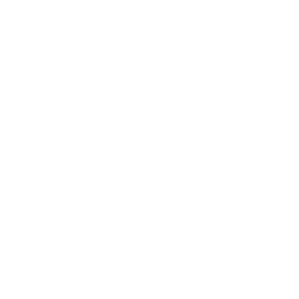

---

## Contents

- [Overview](#overview)
- [Glyphs](#glyphs)
- [Metadata](#glyph-metadata)

---

## Overview

Rendering text using Vulkan is (or can be) a surprisingly complex challenge for a variety of reasons:

* Most of the available frameworks (including the Java AWT implementation) are ultimately based on TrueType fonts where the various character _glphys_ are represented under-the-hood using splines and vectors, which are then converted to bitmaps for rendering.  However the GPU rendering pipeline is specialised around shaders and only works in terms of vertices and texture coordinates.  Therefore the most common approach is to create a texture containing the glyphs for a given font and point size (usually arranged as a grid).  Arbitrary text can be then rendered as a vertex buffer comprising a quad for each character with texture coordinates derived from the grid.

* Unless the font is mono-spaced the character glyphs have different widths, known as the _advance_ of each character, implying that each glyph also requires additional metadata for layout purposes.

* Multi-line text implies a rendering approach where each word is wrapped against a _margin_ and optionally justified or centred, with further metadata for font heights and line spacing.

* Many fonts also alter the spacing between certain pairs of characters to achieve a better looking result (known as _kerning_ pairs), a good example is the capital A and W characters which can be rendered slightly overlapping each other.  Unfortunately the necessary kerning information is often not visible requiring some sort of off-line utility that generates both the texture font and the metadata on a glyph-by-glyph basis.

* Depending on the specific font certain groups of characters can also be combined into a single _ligature_ glyph, for example lower-case `i` following `f` in Times New Roman fonts.

* All of the above imply that colour blending is required for text rendering given that glyphs can often overlap.

Note that for the moment ligatures and non-Latin fonts will be out-of-scope.

The following new components will be required:

* A representation of the glyph metadata.

* The off-line tool to generate the texture font and metadata.

* A custom mesh builder that constructs the vertex buffer for a given piece of text, including word and line-wrapping.

* The colour blending pipeline stage.

TODO - static vs dynamic (i.e. add char)

Initially we will generate a texture image for a simple mono-spaced demo before addressing font metadata and proper spacing with colour blending later in the chapter.

---

## Glyphs

### Glyph Font

The following new type specifies the metadata for a glyph character:

```java
public record Glyph(float advance)
```

Where _advance_ defines the _cursor_ position of the following character.

Additional properties will be added as further functionality is introduced.

A glyph _font_ describes a set of glyphs which are assumed to be arranged as a grid in the associated texture:

```java
public class GlyphFont {
    private final int start;
    private final List<Glyph> glyphs;
    private final int tiles;
}
```

Where _tiles_ specifies the granularity of the texture font, i.e. the number of rows and columns in the grid.

The _start_ property is the index of first character in the font, glyphs can then be retrieved relative to this offset:

```java
public Glyph glyph(char ch) {
    return glyphs.get(ch - start);
}
```

### Glyph Mesh Builder

The font is composed into a new mesh builder implementation for glyph-based text:

```java
public class GlyphMeshBuilder {
    private final GlyphFont font;
    private final MeshBuilder mesh = new MeshBuilder(Primitive.TRIANGLE, new CompoundLayout(Point.LAYOUT, Coordinate2D.LAYOUT));
    private final int tiles;
    private final float size;
    private float scale = 1;
    private float x, y;

    public GlyphMeshBuilder(GlyphFont font) {
        this.font = notNull(font);
        this.tiles = font.tiles();
        this.size = 1f / tiles;
    }
}
```

Where:

* The _scale_ sets the size of the rendered text.

* And _x_ and _y_ specifies the _cursor_ position of the next character to be added to the mesh.

The builder generates a quad for each character added to the mesh:

```java
public GlyphMeshBuilder add(char ch) {
    // Lookup glyph for this character
    Glyph glyph = font.glyph(ch);

    // Render glyph
    if(!Character.isWhitespace(ch)) {
        build(ch);
    }

    // Advance cursor for next character
    x += glyph.advance();

    return this;
}
```

Note that whitespace characters only advance the cursor since there is no point rendering blank glyphs.

The quad for each character is comprised of two counter-clockwise triangles:

```java
```

The texture coordinates for each quad are calculated by the following helper:

```java
private Corners corners(int index) {
    float u = (index % tiles) * size;
    float v = (index / tiles) * size;
    var topLeft = new Coordinate2D(u, v);
    var bottomRight = new Coordinate2D(u + size, v + size);
    return new Corners(topLeft, bottomRight);
}
```

Where `Corners` is a simple convenience type for a pair of texture coordinate corners.

This implementation assumes that the glyphs are arranged in row-major order in the texture.

### Glyph Texture

The final step is to actually generate the texture font image that will be used by the above mesh builder.

There are many utility applications in the wild that generate texture fonts and the associated metadata, however the data formats are often very strange (and there does not appear to be many standards) which would require tedious formatting and/or parsing.  Additionally many of the tools do not export all the required metadata (particularly kerning properties).  Our requirements are fairly trivial so it makes sense to create our own custom tool using Java AWT fonts.

The generator is essentially a builder with the following properties:

```java
public class TextureFontGenerator {
    private int size = 512;
    private int tiles = 16;
    private char start = 0;
    private Color back = new Color(0, 0, 0, 0);
    private Color text = Color.WHITE;
}
```

Where:

* The _size_ is the pixel dimensions of the texture (which is assumed to be square).

* And _tiles_ is the number of glyphs in each direction, i.e. a 16 x 16 grid.

The texture image and metadata are generated by an _instance_ of the generator for a given font:

```java
public class Instance {
    private final Font font;

    public BufferedImage image() {
        ...
    }

    public GlyphFont metadata() {
        ...
    }
}
```

The `image` method creates the actual texture:

```java    
// Create texture font image
var image = new BufferedImage(size, size, BufferedImage.TYPE_4BYTE_ABGR);

// Clear translucent background
var g = (Graphics2D) image.getGraphics();
g.setBackground(back);
g.clearRect(0, 0, size, size);

// Set text colour
g.setFont(font);
g.setColor(text);

...

return image;
```

Each character in the configured range is then drawn to the image as a grid:

```java
int w = size / tiles;
int h = g.getFontMetrics().getHeight();
char ch = start;
for(int r = 0; r < tiles; ++r) {
    int y = r * w + h;
    for(int c = 0; c < tiles; ++c) {
        int x = c * w;
        g.drawChars(new char[]{ch}, 0, 1, x, y);
        ++ch;
    }
}
```

### Command Line Utility

To wrap the generator as a command line utility we employed the rather neat [picocli](https://github.com/remkop/picocli#readme) library that handles argument parsing and auto-magically generates error messages, help and command completion.

First a command line runner is created that defines the various application parameters and options:

```java
@Command(name="texturefont", description="Generates the image grid and associated metadata for a texture font")
private static class Runner implements Callable<Integer> {
    private enum Style {
        PLAIN,
        BOLD,
        ITALIC
    }

    @Parameters(index="0", description="Name of the font to be generated")
    private String name;

    @Parameters(index="1", description="Point size")
    private int size;

    @Option(names={"-s", "--style"}, description="Font style: ${COMPLETION-CANDIDATES}")
    private Style style = Style.PLAIN;

    @Option(names={"-k", "--kerning"}, description="Disable kerning")
    private boolean kerning = true;
}
```

Note that a local enumeration is defined for the various font styles which is more explicit than the plain integer constants used in the AWT `Font` class (using the same ordinal values).

The runner creates the font from the supplied parameters and outputs the resultant texture image:

```java
public Integer call() throws Exception {
    Font font = new Font(name, style.ordinal(), size);
    var generator = new TextureFontGenerator();
    Instance instance = generator.new Instance(font);
    BufferedImage image = instance.image();
    String filename = String.format("%s%d.png", font.getFontName(), font.getSize());
    ImageIO.write(image, ext, new File(filename));
    return 0;
}
```

Which is invoked as follows:

```java
public static void main(String[] args) {
    var cmd = new CommandLine(new Runner());
    int exit = cmd.execute(args);
    System.exit(exit);
}
```

If a required parameter is missing or a supplied option is invalid `picocli` generates a handy usage message, for example:

```java
Invalid value for option '--style': expected one of [PLAIN, BOLD, ITALIC] (case-sensitive) but was 'COBBLERS'
Usage: texturefont [-k] [-s=<style>] <name> <size>
      <name>            Name of the font to be generated
      <size>            Point size
  -k, --kerning         Disable kerning
  -s, --style=<style>   Font style: PLAIN, BOLD, ITALIC
```

Cool.

### Integration

To exercise the texture font the image is generated by the command line utility which should produce something along these lines:



Next a new demo application is created consisting of:

* A rendering pipeline with the basic vertex and texture sampling fragment shaders.

* A texture for the font image.

* And a vertex buffer for the text mesh.

The VBO is configured with a hard-coded glyph font for the moment:

```java
@Configuration
public class VertexBufferConfiguration {
    @Bean
    static GlyphFont font() {
        float advance = 1 / 32f;
        var glyph = new Glyph(advance);
        return new GlyphFont(0, Collections.nCopies(256, glyph), 16);
    }

    @Bean
    static Mesh mesh(GlyphFont font) {
        return new GlyphMeshBuilder(font)
            .scale(2)
            .add("Hello, world!")
            .mesh();
}
```

Running the new demo should generate a fairly simple (if ugly) piece of text:


Note that without colour blending the glyphs may overwrite each other depending on the configuration of the font.

---

## Glyph Metadata

### Persistence

```java
public static class Loader implements ResourceLoader<Element, GlyphFont> {
    private final YamlLoader loader = new YamlLoader();

    public Element map(InputStream in) throws IOException {
        return loader.load(new InputStreamReader(in));
    }
}
```


```java
public GlyphFont load(Element data) throws Exception {
    int start = data.text("start").map(Integer::parseInt).orElse(0);
    int tiles = data.text("tiles").map(Integer::parseInt).orElse(Builder.RANGE);
    List<Glyph> glyphs = data.child("glyphs").children().map(Loader::glyph).toList();
    return new GlyphFont(start, glyphs, tiles);
}
```

### Kerning

### Colour Blending

### Integration

---

## Summary

---

## Summary

