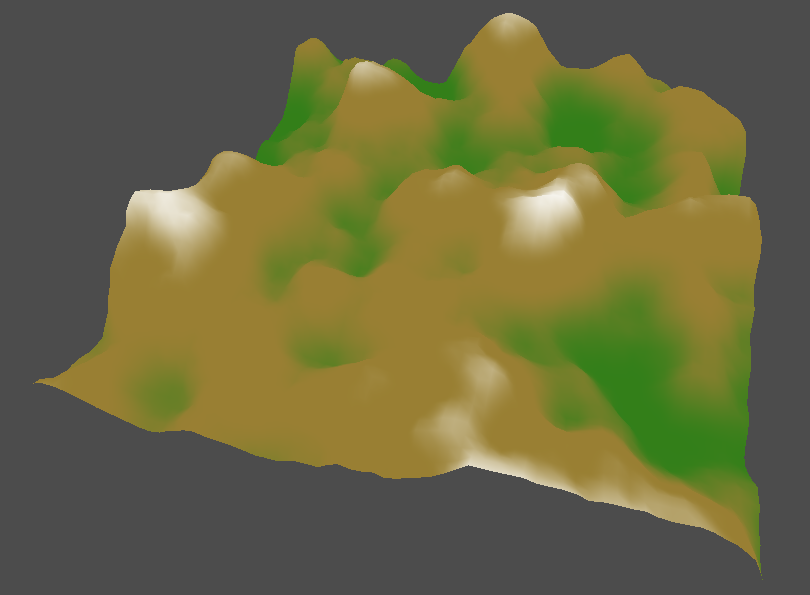

## Overview

During the course of this blog we have implemented the majority of the basic Vulkan components that would be used by most applications, and have reached the end of the Vulkan tutorial.  From here on we will be implementing more advanced features such as lighting, shadows, etc.

Later in this section we will also address the complexity caused by the number of objects that are currently required to render each element of a scene (descriptor sets, render sequences, pools, etc) by the introduction of a _scene graph_ and supporting framework.

In this first chapter we will start a new demo to render a terrain model derived from a height-map image, and then implement level of detail (LOD) functionality for the grid mesh using a _tesselation_ shader.  We will also introduce _push constants_ as a more efficient mechanism for uploading data to the hardware, and _specialization constants_ to parameterise the shader configuration.

This will require the following new components:

* A model builder for a terrain grid.

* The tesselation pipeline stage.

* The addition of push constants to the pipeline layout and a command to update the data.

* A builder for specialisation constants.

---

## Terrain Grid

### Grid Builder

Before we introduce tesselation we will first render a static terrain model.

We start with a new model builder that constructs a _grid_ of _quads_ in the X-Z plane:

```java
public class GridBuilder {
    private Dimensions size = new Dimensions(4, 4);
    private Dimensions tile = new Dimensions(1, 1);
    private float scale = 1;
    private HeightFunction height = HeightFunction.literal(0);
    private Primitive primitive = Primitive.TRIANGLES;
    private IndexFactory index;

    public MutableModel build() {
        ...
    }
}
```

Where:

* _size_ is the dimensions of the grid, i.e. the number of vertices in each direction.

* _tile_ is the dimensions of each quad comprising the grid scaled by the _scale_ parameter.

* And _height_ generates the height (Y coordinate) of each vertex.

* The purpose of the `IndexFactory` is covered below.

The _height function_ is a simple interface that determines the height of a grid vertex:

```java
@FunctionalInterface
public interface HeightFunction {
    /**
     * Calculates the height at the given coordinates.
     * @param row Row
     * @param col Column
     * @return Height
     */
    float height(int x, int y);
}
```

We provide a default implementation for a constant value:

```java
static HeightFunction literal(float height) {
    return (x, y) -> height;
}
```

Note that the builder uses this implementation to set the height of all vertices to zero by default.

The grid is centred on the origin of the model so we first calculate the _half distances_ of the vertices relative to the origin:

```java
public MutableModel build() {
    int w = size.width();
    int h = size.height();
    float dx = tile.width() * scale * (w - 1) / 2;
    float dz = tile.height() * scale * (h - 1) / 2;

    ...

    return model;
}
```

Next the builder iterates through the grid to generate the vertices (in row major order):

```java
List<Vertex> vertices = new ArrayList<>();
for(int row = 0; row < h; ++row) {
    for(int col = 0; col < w; ++col) {
        ...
    }
}
```

The position and height of each vertex is determined as follows:

```java
float x = col * tile.width() * scale - dx;
float z = row * tile.height() * scale - dz;
float y = height.height(col, row);
Point pos = new Point(x, y, z);
```

And the texture coordinate is simply mapped from the row and column indices:

```java
Coordinate coord = new Coordinate2D((float) col / w, (float) row / h);
```

Finally we create the vertex:

```java
Vertex vertex = new Vertex(pos, coord);
vertices.add(vertex);
```

### Index Factory

To generate an index for the model the following factory abstraction is introduced:

```java
@FunctionalInterface
public interface IndexFactory {
    /**
     * Generates indices for a primitives in this strip.
     * @param index Primitive index
     * @param count Number of quads in the strip
     * @return Indices
     */
    IntStream indices(int index, int count);

    /**
     * Generates indices for a strip.
     * @param start Starting index
     * @param count Number of quads in this strip
     * @return Strip indices
     */
    default IntStream strip(int start, int count) {
        return IntStream
            .range(0, count)
            .flatMap(n -> indices(start + n, count));
    }
}
```

This interface is implemented in a new helper class to generate an index for a list of triangles:

```java
public final class Triangle {
    public static final IndexFactory INDEX_TRIANGLES = (index, count) -> {
        int next = index + count + 1;
        return IntStream.of(
            index, next, index + 1,
            next, next + 1, index + 1
        );
    };
}
```

Note that the generated index is comprised of two counter-clockwise triangles per quad.

A triangle _strip_ has a slightly different implementation:

```java
public static final IndexFactory INDEX_STRIP = new IndexFactory() {
    @Override
    public IntStream indices(int index, int count) {
        return IntStream.of(index, index + count + 1);
    }

    @Override
    public IntStream strip(int start, int count) {
        return IntStream
            .rangeClosed(0, count)
            .flatMap(n -> indices(start + n, count));
    }
};
```

Here we override the default `strip` method to also append the final two indices of the triangle strip in the same manner as we did way back in the [Cube Demo](/JOVE/blog/part-3-cube/textures) chapter.  We refactor the cube builder to use the new factory.

Finally the primitive enumeration is modified to provide an index factory:

```java
public enum Primitive {
    TRIANGLES(3, VkPrimitiveTopology.TRIANGLE_LIST, Triangle.INDEX_TRIANGLES),
    TRIANGLE_STRIP(3, VkPrimitiveTopology.TRIANGLE_STRIP, Triangle.INDEX_STRIP),
    ...

    public Optional<IndexFactory> index() {
        return Optional.ofNullable(index);
    }
}
```

The remaining primitives return an empty index factory, the purpose of this addition should become clear shortly.

### Grid Index

The grid builder will support the following use-cases for the index:

1. The general case is a grid comprising the vertices with an index generated by the configured factory.

2. An unindexed grid consisting of duplicate vertices looked up via the index of the primitive (the index is `null` and the index factory of the primitive is one of the triangle implementations above).

3. The degenerate case for an unindexed grid consisting of point vertices (a `null` index, the primitive does not provide a factory).

This is slightly convoluted but provides the flexibility to configure the index behaviour which will be used later when we come to tesselation.

Note that the setter for the _index_ property of the builder accept a `null` value.

The builder first initialises the grid model:

```java
MutableModel model = new MutableModel(primitive, List.of(Component.POSITION, Component.COORDINATE));
```

The model vertices and index are then generated for the above use cases as follows:

```java
if(index == null) {
    Optional<IndexFactory> factory = primitive.index();
    if(factory.isPresent()) {
        // Build unindexed model with duplicate vertices
        buildIndex(factory.get()).mapToObj(vertices::get).forEach(model::add);
    }
    else {
        // Otherwise assume point or patch grid
        vertices.forEach(model::add);
    }
}
else {
    // Build indexed model with the configured factory
    vertices.forEach(model::add);
    buildIndex(index).forEach(model::add);
}
```

The `buildIndex` helper invokes the factory to generate a strip for each row of the grid:

```java
private IntStream buildIndex(IndexFactory factory) {
    int w = size.width() - 1;
    return IntStream
        .range(0, size.height() - 1)
        .map(row -> row * size.height())
        .flatMap(start -> factory.strip(start, w));
}
```

### Height Maps

To generate height data for the terrain grid we will load a _height map_ image.  Although the height of a given vertex can easily be sampled from the image there are several cases where an application will need to programatically 'sample' the height-map, e.g. to generate surface normals or to initialise tesselation factors (as we will see later).

Therefore we essentially emulate a texture sampler by implementing a height function that looks up a pixel from an image.  In any case the image class should support the ability to retrieve pixel data for other use cases.

The height-map function is created using a new factory method:

```java
static HeightFunction heightmap(Dimensions size, ImageData image, int component) {
    // Map grid coordinates to image dimensions
    Dimensions dim = image.extents().size();
    float w = dim.width() / size.width();
    float h = dim.height() / size.height();

    // Calculate height scalar
    float scale = 1 / (float) MathsUtil.unsignedMaximum(Byte.SIZE * image.layout().bytes());

    // Create function
    return (row, col) -> {
        int x = (int) (col * w);
        int y = (int) (row * h);
        return image.pixel(x, y, component) * scale;
    };
}
```

Where _size_ is the grid dimensions and _component_ is the index of the pixel component to retrieve.

This function maps the grid dimensions to those of the image to determine the pixel coordinates and delegates to the new `pixel` method of the image class.  The purpose of the `scale` is to normalise the pixel value to a 0..1 height coordinate.

The implementation for a KTX image is as follows:

```java
public int pixel(int x, int y, int component) {
    int offset = levels.get(0).offset;
    int start = (x + y * extents.size.width()) * layout.length();
    int index = offset + start + (component * layout.bytes());
    return LittleEndianDataInputStream.convert(image, index, layout.bytes());
}
```

Note that the pixel is retrieved from the _first_ MIP level (i.e. the 'full' image) and ignores any array layers.

Since KTX images are little-endian by default the pixel value is transformed using a new utility method:

```java
public static int convert(byte[] bytes, int offset, int len) {
    int value = bytes[offset] & MASK;
    for(int n = 1; n < len; ++n) {
        value = value | (bytes[offset + n] & MASK) << (n * 8);
    }
    return value;
}
```

Finally the KTX loader is improved to handle height-map images with one channel but multiple bytes per channel, e.g. `R16_UINT`:

* The number of bytes in the image layout is derived from the samples section of the DFD (previously was assumed to be one byte).

* This value is validated against the `typeSize` from the header, which also implicitly ensures that __all__ channels have the same size.

* The format hint is fiddled to a normalised type since some of the images have an integral image format which is not supported by Vulkan.

### Integration

In the new application we retain the following from the previous skybox demo:

* The essential Vulkan components (devices, swapchain, etc).

* The orbital camera controller.

* The uniform buffer for the matrices.

* The rendering pipeline, descriptor sets and render sequence for the model.

Next we create the terrain model:

```java
@Bean
public static Model model() {
    return new GridBuilder()
        .size(new Dimensions(64, 64))
        .scale(0.25f)
        .build();
}
```

The vertex shader is the same as the previous demos and the fragment shader simply generates a constant colour for all fragments.  This should render a flat plane since the height of each vertex is zero.

Next we load the height map image and configure the height-map function to generate the height of the grid vertices:

```java
@Bean
public static Model model(ImageData heightmap) {
    Dimensions size = new Dimensions(64, 64);
    return new GridBuilder()
        .size(size)
        .scale(0.25f)
        .height(GridBuilder.HeightFunction.heightmap(size, heightmap, 0))
        .build();
}
```

The height-map image is either gray-scale (i.e. a single colour channel) or an RGBA image.  Note that in either case the height function 'samples' the first channel of the image.

TODO - R16 UINT to UNORM fiddle?

The fragment shader is replaced with following GLSL code to generate a colour based on the `height` of a fragment:

```glsl
#version 450

layout(location = 0) in vec2 fragCoords;
layout(location = 1) in float height;

layout(location = 0) out vec4 outColour;

void main() {
    const vec4 green = vec4(0.2, 0.5, 0.1, 1.0);
    const vec4 brown = vec4(0.6, 0.5, 0.2, 1.0);
    const vec4 white = vec4(1.0);
    
    vec4 col = mix(green, brown, smoothstep(0.0, 0.4, height));
    outColour = mix(col, white, smoothstep(0.6, 0.9, height));
}
```

This should render lower vertices as green, progressing to brown as the height increases, and white for the highest values (this code is based on the example in the Vulkan Cookbook).

The _height_ is an output of the vertex shader:

```glsl
#version 450

layout(binding = 1) uniform UniformBuffer {
    mat4 model;
    mat4 view;
    mat4 projection;
} ubo;

layout(location = 0) in vec3 pos;
layout(location = 1) in vec2 coord;

layout(location = 0) out vec2 outCoord;
layout(location = 1) out float height;

void main() {
    gl_Position = proj * view * model * vec4(pos, 1.0);
    outCoord = coord;
    height = pos.y;
}
```

Note that we pass through the texture coordinates of the grid but these are unused for the moment.

If all goes well we should see something along the lines of this:



---

## Push Constants

### Overview

We will next introduce _push constants_ as an alternative (and more efficient) means of updating the view matrices.

Push constants are used to send data to shaders with some constraints:

* The maximum amount of data is usually relatively small (specified by the `maxPushConstantsSize` of the `VkPhysicalDeviceLimits` structure).

* Push constants are updated and stored within the command buffer itself.

* Push constants have alignment restrictions, see [vkCmdPushConstants](https://www.khronos.org/registry/vulkan/specs/1.2-extensions/man/html/vkCmdPushConstants.html).

### Push Constant Range

We start with a _push constant range_ which specifies a portion of the push constants and the shaders stages where that data is used:

```java
public record PushConstantRange(int offset, int size, Set<VkShaderStage> stages) {
    public int length() {
        return offset + size;
    }

    void populate(VkPushConstantRange range) {
        range.stageFlags = IntegerEnumeration.mask(stages);
        range.size = size;
        range.offset = offset;
    }
}
```

The _offset_ and _size_ of a push constant range must be a multiple of four bytes which is validated in the constructor:

```java
public PushConstantRange {
    ...
    validate(offset);
    validate(size);
}

static void validate(int size) {
    if((size % 4) != 0) throw new IllegalArgumentException(...);
}
```

The builder for the pipeline layout is modified to include a list of push constant ranges:

```java
public static class Builder {
    ...
    private final List<PushConstantRange> ranges = new ArrayList<>();

    public Builder add(PushConstantRange range) {
        ranges.add(range);
        return this;
    }
}
```

The ranges are populated in the usual manner:

```java
public PipelineLayout build(DeviceContext dev) {
    ...
    info.pushConstantRangeCount = ranges.size();
    info.pPushConstantRanges = StructureHelper.first(ranges, VkPushConstantRange::new, PushConstantRange::populate);
    ...
}
```

Note that multiple ranges can be specified:

1. This enabled the application to update some or all of the push constants at different shader stages.

2. And also allows the hardware to perform optimisations.

In the `build` method we also determine the overall size of the push constants and associated shaders stages (which are added to the pipeline layout constructor):

```java
// Determine overall size of the push constants data
int max = ranges
    .stream()
    .mapToInt(PushConstantRange::length)
    .max()
    .orElse(0);

// Enumerate pipeline stages
Set<VkShaderStage> stages = ranges
    .stream()
    .map(PushConstantRange::stages)
    .flatMap(Set::stream)
    .collect(toSet());

// Create layout
return new PipelineLayout(layout.getValue(), dev, max, stages);
```

These new properties are used to validate push constant update commands which are addressed next.

### Update Command

Push constants are backed by a data buffer and are updated using a new command:

```java
public class PushUpdateCommand implements Command {
    private final PipelineLayout layout;
    private final int offset;
    private final ByteBuffer data;
    private final int stages;

    @Override
    public void execute(VulkanLibrary lib, Buffer buffer) {
        data.rewind();
        lib.vkCmdPushConstants(buffer, layout, stages, offset, data.limit(), data);
    }
}
```

Notes:

* The data buffer is rewound before updates are applied, generally Vulkan seems to automatically rewind buffers as required (e.g. for updating the uniform buffer) but not in this case.

* The constructor applies validation (not shown) to verify alignments, buffer sizes, etc.

The new API method is added to the library for the pipeline layout:

```java
void vkCmdPushConstants(Buffer commandBuffer, PipelineLayout layout, int stageFlags, int offset, int size, ByteBuffer pValues);
```

The constructor is public but we also provide a builder:

```java
public static class Builder {
    private int offset;
    private ByteBuffer data;
    private final Set<VkShaderStage> stages = new HashSet<>();

    ...
    
    public PushUpdateCommand build(PipelineLayout layout) {
        return new PushUpdateCommand(layout, offset, data, stages);
    }
}
```

We provide builder methods to update all the push constants or an arbitrary _slice_ of the backing data buffer:

```java
public Builder data(ByteBuffer data, int offset, int size) {
    this.data = data.slice(offset, size);
    return this;
}
```

And the following convenience method to update a slice specified by a corresponding range:

```java
public Builder data(ByteBuffer data, PushConstantRange range) {
    return data(data, range.offset(), range.size());
}
```

Finally we add a convenience factory method to create a backing buffer appropriate to the pipeline layout:

```java
public static ByteBuffer data(PipelineLayout layout) {
    return BufferHelper.allocate(layout.max());
}
```

And a second helper to update the entire push constants buffer:

```java
public static PushUpdateCommand of(PipelineLayout layout) {
    ByteBuffer data = data(layout);
    return new PushUpdateCommand(layout, 0, data, layout.stages());
}
```

### Buffer Wrapper

As a further convenience for applying updates to push constants (or to uniform buffers) we introduce a wrapper for a data buffer:

```java
public class BufferWrapper {
    private final ByteBuffer bb;

    public BufferWrapper rewind() {
        bb.rewind();
        return this;
    }

    public BufferWrapper append(Bufferable data) {
        data.buffer(bb);
        return this;
    }
}
```

The following method provides a random access approach to insert data into the buffer:

```java
public BufferWrapper insert(int index, Bufferable data) {
    int pos = index * data.length();
    bb.position(pos);
    data.buffer(bb);
    return this;
}
```

This can be used to populate push constants or a uniform buffer that is essentially an array of some data type (used below).

In the same vein we add a new factory method to the bufferable class to wrap a JNA structure:

```java
static Bufferable of(Structure struct) {
    return new Bufferable() {
        @Override
        public int length() {
            return struct.size();
        }

        @Override
        public void buffer(ByteBuffer bb) {
            byte[] array = struct.getPointer().getByteArray(0, struct.size());
            BufferHelper.write(array, bb);
        }
    };
}
```

This allows arbitrary JNA structures to be used to populate push constants or a uniform buffer which will become useful in later chapters.

The wrapper class uses the new `BufferHelper` utility which provides the following method to allocate a __direct__ byte buffer:

```java
public final class BufferHelper {
    /**
     * Native byte order for a bufferable object.
     */
    public static final ByteOrder NATIVE_ORDER = ByteOrder.nativeOrder();

    private BufferHelper() {
    }

    /**
     * Allocates a <b>direct</b> byte buffer of the given length with {@link #NATIVE_ORDER}.
     * @param len Buffer length
     * @return New byte buffer
     */
    public static ByteBuffer allocate(int len) {
        return ByteBuffer.allocateDirect(len).order(NATIVE_ORDER);
    }
}
```

A byte array can be written to a buffer:

```java
public static void write(byte[] array, ByteBuffer bb) {
    if(bb.isDirect()) {
        for(byte b : array) {
            bb.put(b);
        }
    }
    else {
        bb.put(array);
    }
}
```

Finally we add support for converting an NIO buffer to a byte array:

```java
public static byte[] array(ByteBuffer bb) {
    if(bb.isDirect()) {
        bb.rewind();
        int len = bb.limit();
        byte[] bytes = new byte[len];
        for(int n = 0; n < len; ++n) {
            bytes[n] = bb.get();
        }
        return bytes;
    }
    else {
        return bb.array();
    }
}
```

And for wrapping an array with a buffer:

```java
public static ByteBuffer buffer(byte[] array) {
    ByteBuffer bb = allocate(array.length);
    write(array, bb);
    return bb;
}
```

Note that direct NIO buffers generally do not support the optional bulk methods.

Existing code that transforms to/from byte buffers is refactored using the new utility methods, e.g. shaders.

### Integration

To use the push constants in the demo application the uniform buffer is first replaced with the following layout declaration in the vertex shader:

```glsl
layout(push_constant) uniform Matrices {
    mat4 model;
    mat4 view;
    mat4 projection;
};
```

In the pipeline configuration we remove the uniform buffer and replace it with a single push constants range sized to the three matrices:

```java
@Bean
PipelineLayout layout(DescriptorLayout layout) {
    int len = 3 * Matrix.IDENTITY.length();

    return new PipelineLayout.Builder()
        .add(layout)
        .add(new PushConstantRange(0, len, Set.of(VkShaderStage.VERTEX)))
        .build(dev);
}
```

Next we create a command to update the whole of the push constants buffer:

```java
@Bean
public static PushUpdateCommand update(PipelineLayout layout) {
    return PushUpdateCommand.of(layout);
}
```

In the camera configuration we use the new helper class to update the matrix data in the push constants:

```java
@Bean
public Task matrix(PushUpdateCommand update) {
    // Init model rotation
    Matrix model = ...

    // Add projection matrix
    BufferWrapper buffer = new BufferWrapper(update.data());
    buffer.insert(2, projection);

    // Update modelview matrix
    return () -> {
        buffer.rewind();
        buffer.append(model);
        buffer.append(cam.matrix());
    };
}
```

Finally the update command is added to the render sequence before starting the render pass.

---

## Tesselation

---

## Specialisation Constants

The new shaders contain a number of hard coded parameters (such as the TODO) which would ideally be programatically configured (possibly from a properties file).

Additionally we would like to centralise common or shared parameters to avoid hard-coding the same information in multiple locations or having to replicate shaders with different parameters.

Vulkan provides _specialisation constants_ for these requirements which can be used to parameterise a shader when it is instantiated.

The set of specialisation constants is created via a new builder in the shader class:

```java
static class ConstantsTable {
    private final Map<Integer, Entry> map = new HashMap<>();
    private int offset;
    
    public ConstantsTable add(int id, Object value) {
        ...
    }
    
    public VkSpecializationInfo build() {
        ...
    }    
}
```

The `add` method creates a new entry in the table and increments the `offset` into the data:

```java
public ConstantsTable add(int id, Object value) {
    // Create transient entry
    Entry entry = new Entry(id, value, offset);
    map.put(id, entry);

    // Increment offset (also validates constant type)
    int size = entry.size();
    offset += size;

    return this;
}
```

An _entry_ is a local transient record for each constant:

```java
private record Entry(int id, Object value, int offset) {
    private void populate(VkSpecializationMapEntry entry) {
        entry.constantID = id;
        entry.offset = offset;
        entry.size = size();
    }
}
```

The _size_ of a constant is determined as follows:

```java
private int size() {
    if(value instanceof Integer) {
        return Integer.BYTES;
    }
    else
    if(value instanceof Float) {
        return Float.BYTES;
    }
    else
    if(value instanceof Boolean) {
        return Integer.BYTES;
    }
    else {
        throw new IllegalArgumentException(...);
    }
}
```

Notes:

* The constant values are stored as anonymous Java objects.

* Only scalar and boolean values are supported.

* Booleans are represented as integer values.

The `build` method constructs the Vulkan descriptor for the set of constants:

```java
public VkSpecializationInfo build() {
    // Ignore if no constants
    if(map.isEmpty()) {
        return null;
    }

    // Populate map entries
    var info = new VkSpecializationInfo();
    Collection<Entry> values = map.values();
    info.mapEntryCount = map.size();
    info.pMapEntries = StructureHelper.first(values, VkSpecializationMapEntry::new, Entry::populate);

    // Populate constant data
    ...

    return info;
}
```

The constants data is essentially a byte array indexed by the _offset_ of each constant:

```java
int size = values.stream().mapToInt(Entry::size).sum();
info.dataSize = size;
info.pData = BufferWrapper.allocate(size);
values.forEach(e -> e.append(info.pData));
```

Where `append` adds each constant to the data buffer:

```java
private void append(ByteBuffer bb) {
    if(value instanceof Integer n) {
        bb.putInt(n);
    }
    else
    if(value instanceof Float f) {
        bb.putFloat(f);
    }
    else
    if(value instanceof Boolean b) {
        VulkanBoolean bool = VulkanBoolean.of(b);
        bb.putInt(bool.toInteger());
    }
    else {
        assert false;
    }
}
```

Finally we implement a convenience method to add a map of constants:

```java
public ConstantsTable add(Map<Integer, Object> map) {
    for(var entry : map.entrySet()) {
        add(entry.getKey(), entry.getValue());
    }
    return this;
}
```

The set of specialisation constants are applied to a shader during pipeline configuration:

```java
public class ShaderStageBuilder {
    private final ConstantsTable constants = new ConstantsTable();
    
    ...
    
    public ShaderStageBuilder constants(Map<Integer, Object> constants) {
        this.constants.add(constants);
        return this;
    }
 
    void populate(VkPipelineShaderStageCreateInfo info) {
        ...
        info.pSpecializationInfo = constants.build();
    }
}
```

TODO - integration example

---

## Summary

In this chapter we rendered a terrain grid using tesselation shaders, and implemented push constants and specialisation constants.

